# IT Operations Management System — Architecture, Workflow and Setup

**Project:** SAP IT Operations Management System (ITOMS)

**Snapshot:** 5 October 2026, through completed Phase 4

**Current runtime:** local SAPUI5/Fiori Elements application with a mock OData V4 service

**Target runtime:** Fiori frontend connected to an ABAP RAP OData V4 service

This is the consolidated project guide. It explains what exists, how requests and
business processes work, how to run the mock system, and how to implement and
connect the future SAP backend. **The ABAP instructions are an implementation
plan: no ABAP backend, SAP deployment, or production authentication has been
implemented in this repository.**

Diagrams use Mermaid fenced blocks. Open this file in a Mermaid-capable Markdown
viewer such as GitHub or Obsidian. In an editor that does not render Mermaid, the
diagram source remains readable. Solid arrows show a relationship or process;
dotted arrows mark planned connections where indicated.

## Contents

1. [Scope and delivery status](#1-scope-and-delivery-status)
2. [Technology and responsibilities](#2-technology-and-responsibilities)
3. [Current mock architecture](#3-current-mock-architecture)
4. [Frontend templates, pages and navigation](#4-frontend-templates-pages-and-navigation)
5. [Data model and ownership](#5-data-model-and-ownership)
6. [OData contract and request workflow](#6-odata-contract-and-request-workflow)
7. [Help Desk workflow](#7-help-desk-workflow)
8. [Asset lifecycle workflow](#8-asset-lifecycle-workflow)
9. [Planned inventory and integrated workflow](#9-planned-inventory-and-integrated-workflow)
10. [Local mock setup](#10-local-mock-setup)
11. [Target ABAP architecture](#11-target-abap-architecture)
12. [ABAP setup and implementation sequence](#12-abap-setup-and-implementation-sequence)
13. [Connecting Fiori to RAP](#13-connecting-fiori-to-rap)
14. [Security, consistency and operations](#14-security-consistency-and-operations)
15. [Testing and acceptance](#15-testing-and-acceptance)
16. [Repository map and further reading](#16-repository-map-and-further-reading)

## 1. Scope and delivery status

ITOMS connects an employee's incident to the affected equipment, technician work,
asset history and, in later phases, spare parts and inventory movements.

| Capability | Current status |
| --- | --- |
| Architecture, local tooling and initial service contract | Phases 0–2 complete |
| Help Desk List Report/Object Page and My IT Support | Phase 3 complete locally |
| Asset Management and My IT Assets | Phase 4 complete locally |
| Asset assignments, transfers, repairs and lifecycle history | Implemented in mock service |
| Materials, stock, reservations and stock movements | Phase 5 planned |
| Integrated parts-to-repair process | Phase 6 planned |
| SLA rules, escalation and configuration | Phase 7 planned |
| Role matrix and management analytics | Phases 8–9 planned |
| Complete RAP design package and real ABAP implementation | Phases 10–11 planned; initial mappings exist |
| SAP authorization, notifications and production launchpad | Phases 12–13 planned |

There is **one application component**, `itoms.helpdesk`, under `apps/help-desk`.
Help Desk and Asset Management are modules/routes within that component. They
share one OData model and one local server. There is no separate inventory app,
technician workbench, dashboard, SQL database, or independent REST backend yet.

The older [business vision](docs/workflow.md) describes the intended final system.
Where it differs from current behavior, the current action tables in this guide
and the Phase 3/4 contracts describe what actually runs. For example, creating a
ticket currently produces `NEW`; submitting it is a separate action.

## 2. Technology and responsibilities

| Layer | Technology / project choice | Responsibility |
| --- | --- | --- |
| UI runtime | SAPUI5 1.144.0, SAP Horizon theme | Controls, binding, responsive layout and application lifecycle |
| Generated pages | SAP Fiori Elements, `sap.fe.templates` | List Reports and Object Pages driven by metadata and annotations |
| Custom pages | XML views, JavaScript controllers, `sap.fe.core.PageController` | My IT Support and My IT Assets |
| UI controls | `sap.m`, `sap.ui.core`, `sap.ui.layout` | Tables, forms, dialogs, messages, status and navigation controls |
| Service client | SAPUI5 OData V4 model | Reads, list queries, creates, bound actions and refreshes |
| Page state | JSONModel on custom pages | Selected preview employee, loaded rows, loading and error state |
| Presentation contract | `annotations/annotation.xml`, EDMX annotations | Columns, facets, selection fields, labels, value help and action availability |
| Configuration | `manifest.json`, YAML files, i18n bundles | Models, routing, dependencies, middleware and text |
| Local runtime | Node.js 24; root package pins 24.21.0 | Development server, mock contributors and scripts |
| Tooling | npm workspaces, UI5 CLI, SAP Fiori tools | Install, serve, preview, generate and build |
| Mock backend | `@sap-ux/ui5-middleware-fe-mockserver` | OData-compatible local endpoint and in-memory data |
| Mock business rules | CommonJS JavaScript contributors in `mock/data` | Validation, transitions, write serialization and history |
| Verification | Playwright 1.63.0, Chrome, Node assertions, fast-xml-parser | Browser, API, contract and fixture checks |
| Future backend | ABAP, CDS, RAP, OData V4 UI binding | Persistent business objects, authorization and transactions |
| Future persistence | Custom SAP tables or released SAP sources | Durable records and enterprise master-data integration |

`package-lock.json` records exact installed dependency versions. Package manifests
may contain ranges; they are not a claim that the latest public versions are used.

**Beginner terms:** metadata describes the available data and operations;
annotations describe how Fiori presents them; OData is the service protocol;
CDS defines SAP data models; RAP adds transactional behavior and service exposure;
a business object is a root record with its owned child records and rules.

## 3. Current mock architecture

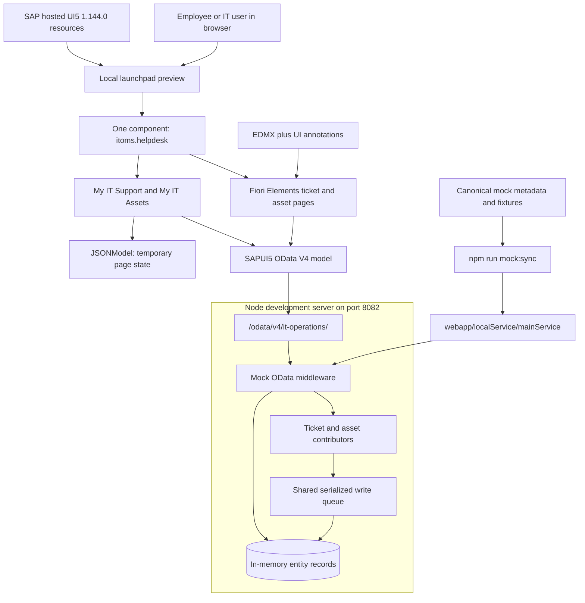

The local server serves the app and handles the OData endpoint. In the normal
preview configuration, its proxy also supplies the SAPUI5 runtime from SAP's
hosted resources. Browser requests use the local origin; this is not a browser
connection to a deployed SAP business service.

### Source of truth and reset behavior

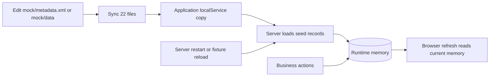

- Edit canonical files in `mock/`; the application copy is synchronized output.
- HTTP writes change memory, not the JSON fixture files.
- Browser refresh preserves runtime changes while that server state remains alive.
- Restarting the server or reloading fixtures restores seed data.
- `sap-client` is used by automated tests to isolate mock data contexts. It is not
  application authentication or a production tenant-security mechanism.

### Contributor responsibilities

| File | Responsibility |
| --- | --- |
| `Tickets.js` | Ticket creation, generated identifiers, actions and history |
| `Assets.js` | Lifecycle actions, custody, repairs, event writes and compensation |
| `_workflow.js` | Shared queue, ticket transitions, validation, timestamps and internal-write Symbol |
| `_asset-workflow.js` | Asset state eligibility, action flags and criticality |
| `_readonly.js` | Reject unsupported external writes; permit trusted internal insertion |
| `_asset-child.js` | Internal assignment/repair updates and rollback removal |
| `_nullable-filter.js` | Local handling of nullable filter values |
| Entity JSON files | Synthetic initial records |

The queue reduces conflicting local writes. Compensation restores earlier rows
when a later write fails. These mechanisms do not provide a durable database
transaction, distributed lock or general OData changeset atomicity.

## 4. Frontend templates, pages and navigation

### How Fiori creates a table

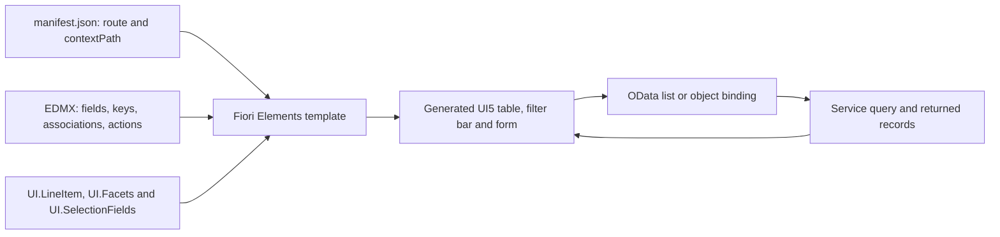

For generated tables, `UI.LineItem` selects columns, `UI.SelectionFields` selects
filters, and `UI.Facets` organizes Object Page sections. `UI.HeaderInfo` supplies
the object title. Action annotations and `Can<Action>` fields drive buttons, while
the backend independently validates whether an action is allowed.

The custom employee pages instead declare `sap.m.Table`, forms and bindings in
XML. Their controllers read through the same OData model and put display state
into JSONModel. The user's manual practice table in My IT Support is retained.

### Route map

Paths below are app-internal hash routes after `#app-preview&/`; `{key}` denotes
the entity UUID substituted by routing.

| Route | Page / purpose |
| --- | --- |
| Application root | Help Desk ticket List Report |
| `Tickets({key})` | Ticket Object Page and ticket actions |
| `MySupport` | Create a ticket and view the selected employee's tickets |
| `Tickets({key})/Requester` | Requester details and assigned assets |
| `Tickets({key})/Asset` | Ticket's affected asset; preserves return navigation to the ticket |
| `Assets` | Asset Management List Report |
| `Assets({key})` | Canonical Asset Object Page |
| `MyAssets` | Equipment assigned to the selected preview employee |

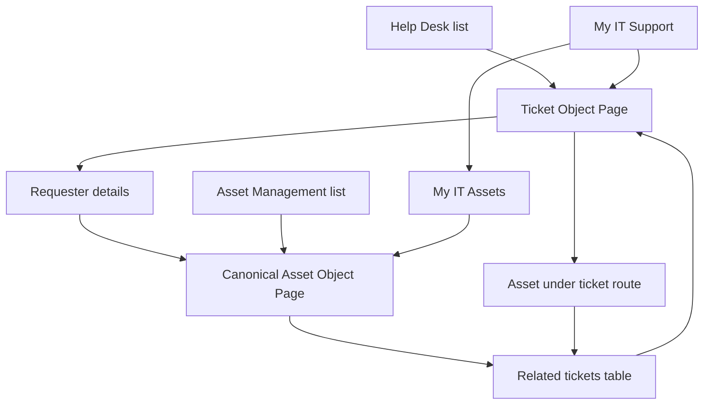

`ext/Navigation.js` implements header navigation. The Object Page controller
extension `ext/RelatedNavigation.controller.js` routes related ticket/asset rows
to their canonical pages. Native Back from the nested ticket asset page returns
to its originating ticket.

The initial List Report may say **Let's get some results** until **Go** is pressed.
That state means a search has not run; it does not by itself mean the database is
empty. Clear filters and press Go before investigating missing records.

## 5. Data model and ownership

### Implemented entities

| Entity set | Technical key | Seed rows | Ownership / purpose |
| --- | --- | ---: | --- |
| Employees | EmployeeUUID | 6 | Read-only employee/user reference |
| Tickets | TicketUUID | 9 | Ticket root |
| Assets | AssetUUID | 8 | Asset root |
| TicketComments | TicketCommentUUID | 14 | Ticket-owned comments; currently read-only |
| TicketHistory | TicketHistoryUUID | 31 | Ticket-owned action history |
| AssetAssignments | AssetAssignmentUUID | 4 | Asset-owned custody intervals |
| AssetRepairs | AssetRepairUUID | 2 | Asset-owned repair records |
| AssetHistory | AssetHistoryUUID | 8 | Asset-owned lifecycle events |
| **Total** | | **82** | **8 sets, 26 navigation properties** |

UUIDs are technical keys. TicketNumber, AssetTag and EmployeeNumber are readable
business identifiers. Associations use UUIDs, not names or email addresses.
Optional relationships use `null`. Audit timestamps use UTC DateTimeOffset;
warranty and purchase dates use calendar Date values.

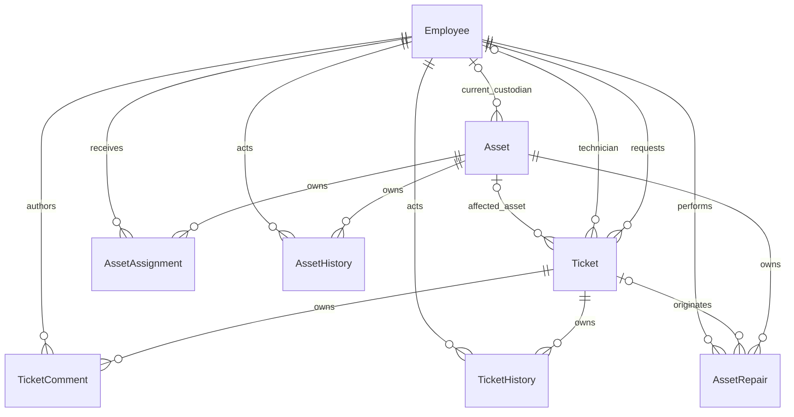

This graph shows principal relationships; the metadata also exposes reverse
collections and old/new employee references on AssetHistory. A ticket references
an asset but does not own it. An employee is a reference source, not a custom HR
master maintained by this app. History ownership does not authorize deletion.

Detailed field dictionaries are in [service contract](docs/service-contract.md)
and [asset lifecycle contract](docs/asset-lifecycle.md).

## 6. OData contract and request workflow

The manifest's default model uses `mainService`, whose URI is
`/odata/v4/it-operations/`. The current namespace is `ITOperations`.

| Request | Purpose |
| --- | --- |
| `GET /odata/v4/it-operations/$metadata` | Obtain service schema and capabilities |
| `GET /odata/v4/it-operations/Tickets?$top=10&$count=true` | Read a page of tickets |
| `GET /odata/v4/it-operations/Assets(<UUID>)?$expand=Assignments,Repairs,History` | Read asset details and children |
| `POST /odata/v4/it-operations/Tickets` | Create a NEW ticket |
| `POST /odata/v4/it-operations/Tickets(<UUID>)/ITOperations.Submit` | Submit a ticket |
| `POST /odata/v4/it-operations/Assets(<UUID>)/ITOperations.AssignAsset` | Assign an available asset |

`<UUID>` is a placeholder to replace, not literal URL text. OData may combine
requests in `$batch`. The UI uses server-side operations, with automatic
selection/expansion enabled in the model configuration.

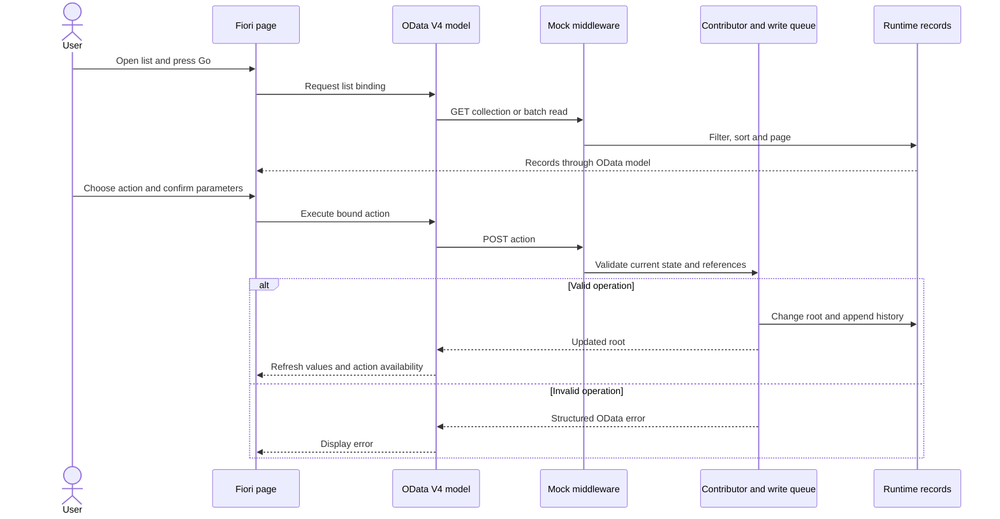

Local errors distinguish invalid input (`400`), missing records (`404`),
unsupported direct writes (`405`) and state conflicts (`409`). A visible button
is never the sole permission check. Direct status PATCH is not the workflow API.

## 7. Help Desk workflow

### Current user journey

1. Open **My IT Support** and select a simulated employee.
2. Enter subject, description, category and priority. Select assigned equipment
   or **No specific asset**.
3. Create the ticket. The service supplies its UUID, number, `NEW` state and audit data.
4. Open the ticket and choose **Submit ticket**.
5. Assign an IT Support technician, then start work.
6. If blocked, put the ticket on hold with a reason and resume when ready.
7. Resolve with resolution notes. The employee confirms closure or reopens the
   resolved ticket with a reason.

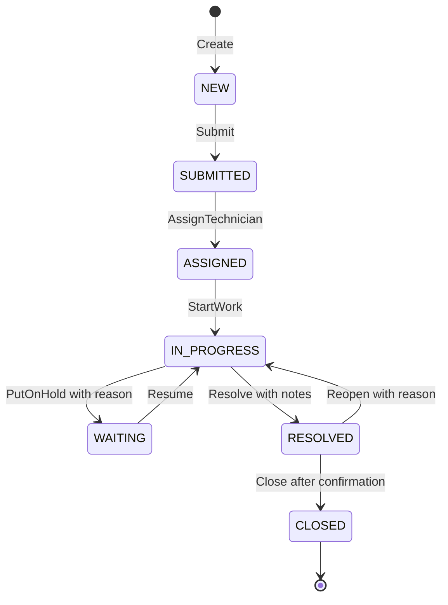

| Action | Input beyond ticket key | Current transition |
| --- | --- | --- |
| Submit | None | NEW → SUBMITTED |
| AssignTechnician | TechnicianUUID | SUBMITTED → ASSIGNED |
| StartWork | None | ASSIGNED → IN_PROGRESS |
| PutOnHold | Reason, 1–500 trimmed characters | IN_PROGRESS → WAITING |
| Resume | None | WAITING → IN_PROGRESS |
| Resolve | Resolution, 1–4000 trimmed characters | IN_PROGRESS → RESOLVED |
| Close | None | RESOLVED → CLOSED |
| Reopen | Reason, 1–500 trimmed characters | RESOLVED → IN_PROGRESS |

Every successful action appends history. Reopening clears the current resolution
and completion timestamps while retaining the previous resolution in history.
Reassignment and reopening CLOSED tickets are not implemented. `REOPENED` is not
a persisted status. New requests validate that the selected asset belongs to the
requester. Comments currently come from fixtures; adding comments is future work.

The preview simulates actor identity: requester for create/submit/close/reopen,
EMP-0006 for assignment, and the assigned technician for work actions. This does
not prevent another preview user from executing those actions.

## 8. Asset lifecycle workflow

Asset details show identity, warranty dates, custodian, assignment intervals,
repairs, related tickets and lifecycle history. **My IT Assets** filters by the
selected employee's current custody, including equipment under repair.

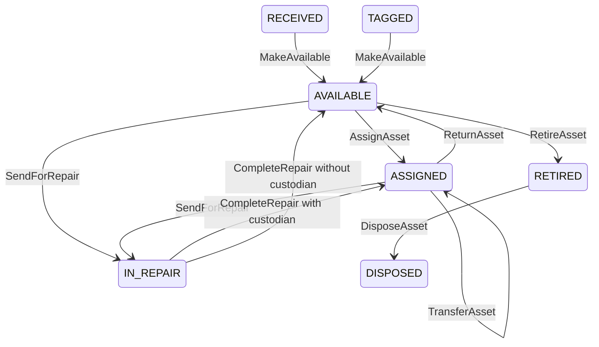

RECEIVED and TAGGED are seeded intake examples. There is no asset-creation or
tag-allocation action yet, so the diagram does not imply a working tagging step.

| Action | Parameters | Effect |
| --- | --- | --- |
| MakeAvailable | Reason | Mark RECEIVED/TAGGED equipment available |
| AssignAsset | EmployeeUUID, Reason | Open custody interval and set employee location |
| TransferAsset | EmployeeUUID, Reason | Close current interval and open a different employee's interval |
| ReturnAsset | Reason | Close custody and clear employee; retain last location |
| SendForRepair | TechnicianUUID, optional TicketUUID, Diagnosis | Create OPEN repair; preserve any existing custody |
| CompleteRepair | RepairDescription | Complete repair and restore ASSIGNED or AVAILABLE |
| RetireAsset | Reason | Retire available equipment |
| DisposeAsset | Reason | Dispose retired equipment |

Reason, Diagnosis and RepairDescription require 1–4000 trimmed characters. A repair
technician must belong to IT Support. An optional repair ticket must reference the
same asset. The current demo supervisor EMP-0006 is the simulated asset-action actor.

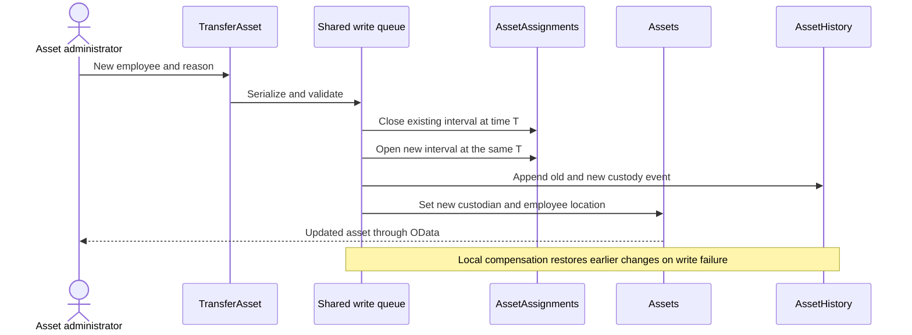

One current custodian corresponds to exactly one open assignment. A transfer must
select a different employee. IN_REPAIR corresponds to exactly one open repair.
Completing a repair does **not** close the linked ticket or consume stock.
Most seed events are explicitly labelled Baseline; they do not reconstruct a full
historical ledger. Runtime actions append new events.

For a hands-on demonstration, open **Asset Management → Go → IT-LAP-00502** and
make it available, assign, transfer, repair, return, retire and dispose it.
Use **IT-LAP-00452** to inspect an existing ticket-linked repair.

## 9. Planned inventory and integrated workflow

The following graph is the target process for Phases 5–6. Inventory operations
shown here are not available in the current app.

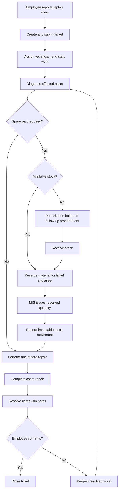

### Planned inventory relationships

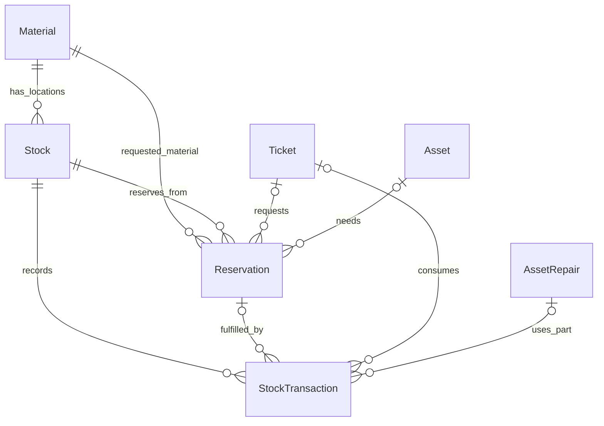

Planned quantities obey `available = physical − outstanding reserved`.

| Operation | Planned stock effect |
| --- | --- |
| Receive / return | Increase physical quantity and record movement |
| Reserve | Increase outstanding reserved quantity |
| Issue reserved material | Reduce physical and reserved quantities together |
| Cancel reservation | Release the unfulfilled reserved quantity |
| Transfer | Linked debit/credit at two locations in one transaction |
| Adjust | Authorized correction with mandatory reason and movement |

Stock is unique per material and storage location. Balances are not edited
directly. Repeated partial issues retain the reservation reference. Ticket, asset
and repair references must agree. If standard SAP inventory owns these records,
integrate its released APIs instead of maintaining competing stock balances.

SLA determination, at-risk/breach monitoring, escalation, notifications and KPI
drill-downs are later capabilities. Existing priority/status colors do not imply
that an SLA engine has already been implemented.

## 10. Local mock setup

### Step 1 — Prepare the workstation

Use Node.js 24, npm, Git and a code editor. SAP Fiori tools in VS Code are useful
for development. Chrome is required by this repository's Playwright configuration.
The normal preview needs network access to SAP's UI5 resources.

### Step 2 — Install the checked-in dependencies

Open a terminal in the project root, beside `package.json`:

```bash
node --version
npm ci
npm run doctor
```

Use the lockfile for reproducibility. The generator script is for scaffolding;
do not regenerate the existing app as a routine startup step.

### Step 3 — Validate and synchronize the mock contract

```bash
npm run mock:sync
npm run validate:contract
```

Expected baseline: 22 synchronized files, eight entity sets and 82 seed records.
The validator checks keys, types, nullability, relationships, custody intervals
and repair consistency. `mock:check` detects drift without copying files.

### Step 4 — Start the preview

```bash
npm run preview
```

Open **http://localhost:8082/test/flp.html#app-preview**. Alternatively, `npm start`
starts the same mock configuration without explicitly opening the preview URL.
The scripts already use **8082**, because 8080 was occupied earlier. Live reload
uses 35730.

If 8082 is also occupied, inspect its listener before starting another instance:

```bash
lsof -nP -iTCP:8082 -sTCP:LISTEN
```

Reuse the correct running server or stop it in its original terminal. To select
another permanent preview port, change both `start` and `preview` in
`apps/help-desk/package.json`, and update Playwright's baseURL and webServer URL.
Check the live-reload port too if running multiple preview servers.

### Step 5 — Try the workflows

1. Press **Go** on Help Desk to load tickets.
2. Open a ticket; inspect requester, asset, comments and history.
3. Use **My IT Support** to create and submit a ticket.
4. Use ticket actions to assign, work, resolve and close it.
5. Open **Asset Management**, press Go and try the asset walkthrough above.
6. Open **My IT Assets** and switch employees; an empty equipment list is valid
   for employees without assigned assets.

### Step 6 — Verify changes

```bash
npm test
npm run build
npm run doctor
```

Tests automatically check synchronized metadata/fixtures before running. The build
produces `apps/help-desk/dist`; mock and test resources are excluded from production
build output. A successful build is not a SAP deployment.

### Configuration files explained

| File | Use |
| --- | --- |
| `ui5-mock.yaml` | Normal preview: UI5 proxy, reload, launchpad preview and mock middleware |
| `ui5-local.yaml` | Alternative SAPUI5 framework-library configuration; still uses mock middleware |
| `ui5.yaml` | Base tooling/build configuration; no configured real SAP backend |
| `manifest.json` | App identity, OData model, annotations, dependencies and routes |

**`start-local` does not mean “connect to ABAP.”** It still loads local mock data.

## 11. Target ABAP architecture

The frontend continues to consume OData V4. The mock implementation is replaced
by a RAP business service; the JavaScript contributors are business-rule references
to reimplement, not code that can be deployed as ABAP.

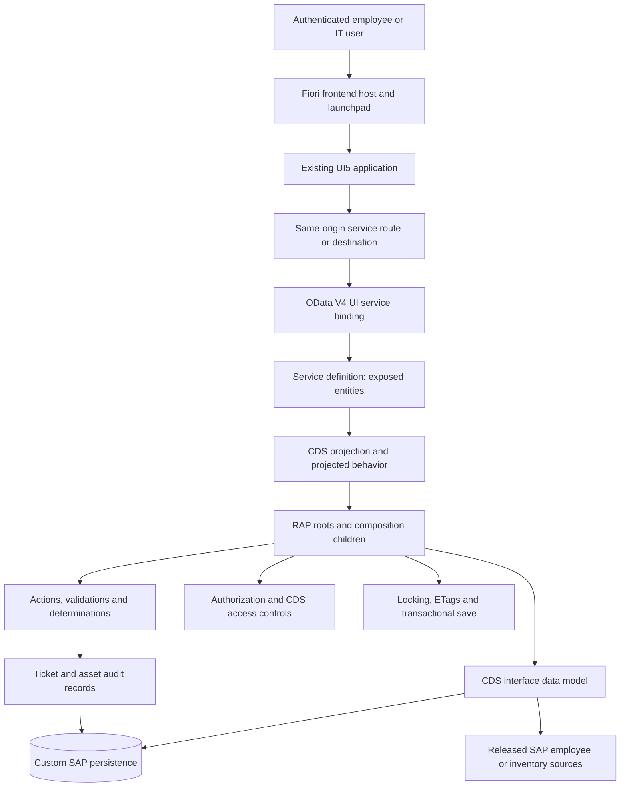

This is a logical dependency graph, not a claim that every read executes a custom
behavior method. Reads expose the CDS model; transactional operations execute
the applicable RAP behavior and save sequence. SAP documents RAP as the
combination of CDS modeling, ABAP behavior and business-service exposure.
[SAP RAP overview](https://help.sap.com/docs/abap-cloud/abap-rap/abap-restful-application-programming-model)

### Planned object mapping

All names below are design identifiers to validate in the chosen SAP release.

| Public set | Planned source/table | CDS interface → projection |
| --- | --- | --- |
| Employees | Released employee/user source with stable UUID mapping | ZI_IT_Employee → ZC_IT_EmployeeProfile |
| Tickets | ZIT_TICKET | ZI_IT_Ticket → ZC_IT_Ticket |
| TicketComments | ZIT_TICKET_COMMENT | ZI_IT_TicketComment → ZC_IT_TicketComment |
| TicketHistory | ZIT_TICKET_HISTORY | ZI_IT_TicketHistory → ZC_IT_TicketHistory |
| Assets | ZIT_ASSET | ZI_IT_Asset → ZC_IT_Asset |
| AssetAssignments | ZIT_ASSET_ASSIGN | ZI_IT_AssetAssignment → ZC_IT_AssetAssignment |
| AssetRepairs | ZIT_ASSET_REPAIR | ZI_IT_AssetRepair → ZC_IT_AssetRepair |
| AssetHistory | ZIT_ASSET_HISTORY | ZI_IT_AssetHistory → ZC_IT_AssetHistory |
| Materials — later | ZIT_MATERIAL or standard integration | ZI_IT_Material → ZC_IT_Material |
| Stocks — later | ZIT_STOCK or standard integration | ZI_IT_Stock → ZC_IT_Stock |
| Reservations — later | ZIT_RESERVATION or standard integration | ZI_IT_Reservation → ZC_IT_Reservation |
| StockTransactions — later | ZIT_STOCK_TXN or standard integration | ZI_IT_StockTransaction → ZC_IT_StockTransaction |

Ticket and Asset are independent RAP roots. Their history and child records are
compositions; Requester, Technician and affected Asset remain associations.
The inventory design initially uses a Material root with stock/reservation/movement
children, subject to whether standard SAP business objects own inventory instead.

The intended service definition is **ZUI_IT_OPERATIONS** and the intended OData V4
UI binding is **ZUI_IT_OPERATIONS_O4**. AssetHistory was added in Phase 4 and extends
the earlier RAP baseline inventory.

## 12. ABAP setup and implementation sequence

### Step 1 — Identify the SAP landscape

Obtain the actual system URL, supported release, developer user, development
package/transport policy and service-exposure policy from the SAP administrator.
Choose the instructions appropriate to that landscape:

| Landscape | Development connection | Important distinction |
| --- | --- | --- |
| SAP BTP ABAP Environment | ABAP Cloud project in Eclipse ADT | Requires an available ABAP environment and developer access |
| S/4HANA Cloud ABAP environment | Landscape-supported ADT cloud connection | Use its released development and identity capabilities |
| S/4HANA on-premise/private cloud | ADT connection supplied by administrator | RAP/OData V4 support and Gateway publication depend on the installed release |

Installing Eclipse or running npm does not create an ABAP server. This repository
contains no SAP credentials, provisioning automation or deploy-ready ABAP package.

### Step 2 — Install ADT and connect

Install Eclipse with SAP ABAP Development Tools appropriate for your system.
For BTP ABAP Environment, choose **File → New → Other → ABAP Cloud Project**,
enter the provided ABAP instance URL, open the browser logon, authenticate and
finish the connection. Use the administrator's supported connection flow for an
on-premise system. Verify that you can browse development objects before proceeding.
[SAP ADT cloud-project setup](https://developers.sap.com/tutorials/abap-environment-create-abap-cloud-project)

### Step 3 — Create a development package

Create a project package, for example a team-approved `ZIT_OPERATIONS`, and assign
the appropriate software component and transport request. Reserve naming conventions
before generating objects. Develop in a transportable package for organizational
delivery; a tutorial's local package choice is not a production transport strategy.

SAP's RAP tutorial demonstrates package/table creation and ADT's service generator.
Its generated sample is a starting scaffold; ITOMS still needs its own relationships,
actions and rules. Generator availability and draft defaults vary by target system.
[SAP RAP service generation tutorial](https://developers.sap.com/tutorials/abap-environment-rap100-generate-ui-service)

### Step 4 — Establish the contract baseline

Use `mock/metadata.xml` and the field dictionaries as the public contract inventory.
For each field, document its SAP type, maximum length, null handling and public
name. Preserve UUID identity and define source-employee mapping. Separate human
identifiers from keys. Decide how generated action namespaces will be referenced
by the frontend before exposing the service.

### Step 5 — Create persistence or integrate released sources

Create Ticket/Asset roots and their required child tables from the mapping above.
Include audit columns, unique business identifiers and reference integrity rules.
Keep employee data owned by its authoritative source. Do not copy synthetic
fixtures into production. In development, use a controlled sample-data loader to
exercise the same business scenarios without assuming the mock UUIDs are real users.

### Step 6 — Build the CDS model

Define root/interface views and child entities. Model ticket Comments/History and
asset Assignments/Repairs/History as compositions. Add associations for requester,
technician, custodian and affected asset. Expose stable keys and meaningful labels.
Build projections and redirect associations so exposed navigation reaches the
correct projection. Check generated metadata rather than assuming database field
types produce identical OData nullability or timestamp precision.

### Step 7 — Define and implement RAP behavior

Implement the existing ticket and asset action names and parameter contracts.
Use managed persistence where suitable, or a supported integration approach for
standard SAP objects. Behavior implementation must:

- Generate numbers, timestamps and actor values on the server.
- Validate required text, eligible references and permitted transitions.
- Enforce one current assignment and one open repair when applicable.
- Update roots and append history in the same business transaction.
- Return meaningful field/action errors and updated results.
- Calculate operation availability while independently enforcing backend rules.
- Reject direct edits that bypass lifecycle or overwrite audit history.

Use RAP's transaction and save mechanisms; do not reproduce the Node Promise
queue as the SAP concurrency strategy. Plan cross-root changes explicitly.

### Step 8 — Decide concurrency, draft and authorization

Select lock ownership and ETag fields supported by the target release. Test stale
updates from two sessions. If draft is adopted, define its lifecycle and generated
keys, then adapt the frontend and tests deliberately: the current contract has no
draft behavior. `LastChangedAt` alone does not make the mock ETag-enabled.

Map the authenticated SAP identity to an employee/user reference. Define RAP
instance/global authorization and applicable CDS access controls. Use the target
landscape's role mechanisms; do not assume PFCG is the administration model for
every ABAP Cloud deployment. Authorization is needed before exposing real data,
even though the broader role rollout appears later in the roadmap.

### Step 9 — Define the service and binding

Expose the projection entities with the intended public aliases in
`ZUI_IT_OPERATIONS`. The following is an **illustrative service definition**, valid
only after the named projection entities exist and pass target-system checks:

```abap
@EndUserText.label: 'IT Operations'
define service ZUI_IT_OPERATIONS {
  expose ZC_IT_EmployeeProfile as Employees;
  expose ZC_IT_Ticket          as Tickets;
  expose ZC_IT_TicketComment   as TicketComments;
  expose ZC_IT_TicketHistory   as TicketHistory;
  expose ZC_IT_Asset           as Assets;
  expose ZC_IT_AssetAssignment as AssetAssignments;
  expose ZC_IT_AssetRepair     as AssetRepairs;
  expose ZC_IT_AssetHistory    as AssetHistory;
}
```

Create and activate `ZUI_IT_OPERATIONS_O4` with binding type **OData V4 - UI**.
The definition selects exposed entities; the binding attaches the protocol and
provides the endpoint. Use the endpoint reported by your system, not an invented
URL derived from the object name.
[SAP service binding documentation](https://help.sap.com/docs/abap-cloud/abap-rap/service-binding)

### Step 10 — Publish in the appropriate environment

In ABAP Cloud, use the supported service-binding **Publish** flow and open the
entity preview. For S/4HANA on-premise/private cloud, SAP's RAP tutorial directs
publication through **/IWFND/V4_ADMIN**; have the responsible administrator choose
the correct service group and system alias. Activation and publication are distinct,
and publication must be handled in each target landscape.
[SAP publication instructions](https://developers.sap.com/tutorials/abap-environment-rap100-generate-ui-service)

### Step 11 — Verify the service before switching the app

Check `$metadata`, collection/key reads, associations, filters, paging, batch reads
and actions. Test business failures, unauthorized users, transaction rollback and
concurrency. Preview both Ticket and Asset entities. Confirm history is generated
by behavior and cannot be modified directly. ABAP Unit and suitable service/UI
integration tests should accompany the implementation.

### Step 12 — Connect and deploy the frontend

Follow the migration sequence below. Choose the actual frontend hosting model
with the SAP team: a supported ABAP frontend repository/launchpad or BTP HTML5
hosting and launchpad integration. Configure destinations, identity and roles for
that model. Those deployment artifacts are not currently present in this project.

## 13. Connecting Fiori to RAP

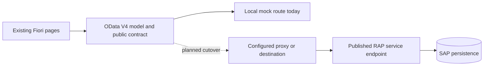

The desired frontend route remains `/odata/v4/it-operations/`. A landscape-specific
proxy/destination can map it to the real binding URL. Merely changing the URL does
not guarantee compatibility: RAP may generate a different namespace, action
qualification, null representation, draft keys or capability metadata.

### Concrete cutover sequence

1. Preserve the working mock configuration for local regression tests.
2. Add a separate real-backend tooling configuration, for example `ui5-abap.yaml`,
   once the actual endpoint and authentication mechanism are known. This file is
   a proposed addition, not an existing project file.
3. In that configuration, replace the mock middleware at the service path with
   the supported backend proxy. Do not let both handlers serve the same path.
4. Store environment-specific destination/authentication settings in the approved
   local or platform configuration. Keep credentials out of source files.
5. Compare generated RAP metadata against the canonical contract. Keep public
   aliases where possible; update annotation targets and action references for
   deliberate namespace differences. Change the manifest URI only if the chosen
   hosting arrangement requires it.
6. Keep `annotations/annotation.xml` for presentation initially. If annotations
   move to CDS metadata extensions, resolve overlapping terms intentionally.
7. Test authenticated reads and writes, CSRF/session handling and CSRF renewal
   where required by the SAP endpoint. Use HTTPS in the real landscape.
8. Re-run the ticket and asset scenarios with a dedicated SAP test data set.
9. Build and deploy to the selected frontend host, configure launchpad content,
   assign roles, and run user acceptance tests with real role separation.

Do not point the existing mutation tests at production. They create and change
records. Their mock `sap-client` isolation and fixed fixture IDs do not translate
directly into SAP test isolation; build a dedicated integration-test configuration.

### Migration compatibility checklist

| Area | What must be checked |
| --- | --- |
| Schema | Entity-set aliases, UUID keys, field names/types/lengths/nullability |
| Navigation | All 26 current navigation properties and nested expansion |
| Actions | Namespaces, parameters, binding, return values and side effects |
| Queries | Filter, search, sort, count, paging and continuation handling |
| Errors | User-readable OData errors and correct field/action targeting |
| Writes | Atomic root/history updates and cross-root consistency |
| Security | Authenticated user mapping and read/action authorization |
| Concurrency | Locks, If-Match/ETags and conflicting sessions |
| Draft | Explicitly supported and tested, or intentionally absent |
| UI | Value help, action refresh, links, Back behavior and mobile layout |

## 14. Security, consistency and operations

### Planned role responsibilities

| Actor | Intended responsibility |
| --- | --- |
| Employee | Own tickets/assets, incident submission and resolution confirmation |
| IT technician | Assigned work, diagnosis, repair and resolution |
| Help Desk supervisor | Triage, assignment and workload management |
| Asset administrator | Custody and asset lifecycle |
| MIS / store officer | Inventory receipt, reservation fulfillment and movements |
| IT manager | Operational oversight and analytics |
| System administrator | Configuration and system administration |

This is a responsibility overview, not an implemented permission matrix. Current
employee selection and action availability are simulations. Production controls
must restrict both reads and actions on the server.

### What changes between mock and SAP

| Concern | Current mock | Required SAP implementation |
| --- | --- | --- |
| Storage | In-memory seeded records | Durable persistence or authoritative released source |
| Identity | Selected employee and demo actors | Authenticated identity with stable mapping |
| Authorization | No production access boundary | Backend checks and applicable access controls |
| Concurrency | Shared process queue | RAP locks/ETags and transactional rules |
| Failure recovery | Local compensation | Verified transactional save and operational recovery |
| History | Synthetic baseline plus runtime events | Trusted server-side audit records |
| Scale | Demo data; My IT Assets has 10,000-row JSON display limit | Server-driven paging, indexing and measured performance |
| Monitoring | Development output and tests | Landscape logging, errors, alerts and audit review |
| Deployment | Local preview/build | Managed DEV → QA → production delivery |

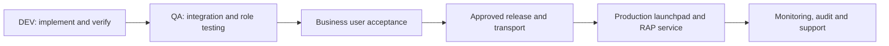

The production path is planned. No CI deployment, transport pipeline, backup
process or notification service is claimed by the local MVP.

## 15. Testing and acceptance

The last completed Phase 4 run on 5 October 2026 recorded **46 passing tests**:

| Test area | Count | Coverage |
| --- | ---: | --- |
| Contract | 27 | Eight sets, keys, fields, queries, nulls and navigation |
| Asset workflow | 7 | Lifecycle, repairs, invalid actions, protected writes, concurrency and rollback |
| Ticket workflow | 6 | Creation, transitions, history, invalid input and concurrency |
| Preview/browser | 6 | OData model, ticket workflow, asset actions, navigation and mobile equipment view |

Build and doctor checks also passed. This documents the prior acceptance run;
it is not a claim that ABAP has passed these tests. See the
[Phase 4 report](docs/phase-4-report.md) and its screenshots.

Before declaring the SAP migration complete, require equivalent business outcomes
against RAP plus authorization, concurrency, rollback and deployment validation.
Test the current ticket and asset flows first; the full SSD/inventory scenario
also requires Phases 5–6 to be implemented.

### Quick troubleshooting

| Symptom | First checks |
| --- | --- |
| Empty initial List Report | Press Go; clear filters; distinguish initial state from zero matches |
| No equipment for an employee | Check CurrentEmployeeUUID; an empty assignment list can be correct |
| Old fixture data | Edit canonical mock files, sync, then account for fixture reload/reset |
| Preview cannot load | Check port listener, server output and network access to UI5 resources |
| Action unavailable | Check current state and operation flags; inspect OData error if rejected |
| Data disappears after restart | Expected for in-memory mocks; no database persistence yet |
| SAP endpoint returns unauthorized | Verify identity, roles, destination and backend authorization |
| Fiori breaks after SAP switch | Compare metadata, namespace/action references and navigation first |

## 16. Repository map and further reading

```text
SAP IT OPERATIONS/
├── PROJECT_ARCHITECTURE_AND_WORKFLOW.md   This consolidated guide
├── README.md                            Entry point and commands
├── package.json / package-lock.json      Workspace scripts and dependency lock
├── apps/help-desk/
│   ├── package.json                     Application serve/build scripts
│   ├── ui5-mock.yaml                    Main local mock configuration
│   ├── ui5-local.yaml                   Framework-library mock configuration
│   ├── ui5.yaml                         Base/build configuration
│   └── webapp/
│       ├── Component.js                 Fiori application component
│       ├── manifest.json                Models, routes and page settings
│       ├── annotations/annotation.xml   Fiori presentation annotations
│       ├── ext/Navigation.js            Header navigation
│       ├── ext/RelatedNavigation.controller.js
│       ├── ext/support/                 My IT Support XML and controller
│       ├── ext/assets/                  My IT Assets XML and controller
│       ├── i18n/                        Text bundles
│       ├── localService/mainService/    Synchronized mock service copy
│       └── test/                        Local launchpad preview resources
├── mock/
│   ├── metadata.xml                     Canonical OData contract
│   └── data/                            Fixtures and JavaScript contributors
├── scripts/                             Sync, validation, doctor and generator
├── tests/                               Playwright API and browser suites
├── playwright.config.cjs                Test browser, server and base URL
├── docs/                                Phase reports, guides and evidence
└── sap-design/                          Planned CDS, RAP and authorization design
```

### Project references

- [Roadmap and phases](docs/phases.md)
- [Original business workflow and future vision](docs/workflow.md)
- [Architecture baseline](docs/architecture.md)
- [Current Help Desk action contract](docs/help-desk-workflow.md)
- [Current asset action contract and field dictionary](docs/asset-lifecycle.md)
- [OData field dictionary](docs/service-contract.md)
- [Domain entity model](sap-design/data-model/entities.md)
- [Public service to RAP mapping](sap-design/services/rap-mapping.md)
- [Initial RAP baseline](sap-design/rap/baseline.md)
- [Naming conventions](sap-design/naming-conventions.md)
- [Beginner guide through Phase 3](docs/beginner-guide-phases-0-3.md)
- [Phase 4 completion report](docs/phase-4-report.md)

The diagrams summarize the checked-in implementation and planned domain design.
They are not generated SAP system topology or proof of a deployed backend.
