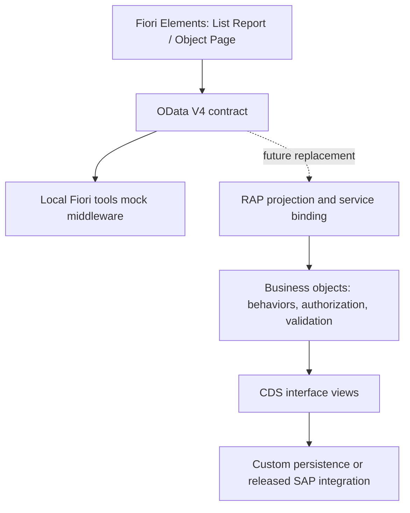

# ITOMS architecture — baseline v1

Status: phase 0 baseline, 22 September 2026. The scope and sequence in
[phases](phases.md) govern implementation. [Workflow](workflow.md) governs business
transitions; the [original design](SAP_Fiori_IT_Operations_Management_System.md)
remains the product vision. This baseline resolves differences between those inputs.

## Runtime boundaries

Phase 1 generated the Help Desk application under `apps/help-desk`. Phase 2 now
provides the [read contract](service-contract.md) for Employees, Tickets, Assets,
TicketComments and TicketHistory, with realistic synthetic fixtures and navigation.
Phase 3 adds [validated local ticket creation/actions](help-desk-workflow.md),
serialized writes and event history. These local rules do not imply SAP authorization,
durable transactions, ETags or deployment readiness.

The stable frontend service root is `/odata/v4/it-operations/`; an eventual
landscape destination/proxy maps it to the RAP binding. Components use the manifest
OData V4 model, never SAP table names or an alternative REST API. Local annotations
hold presentation concerns. Backend annotations can later replace matching terms.
The UI5 runtime is version-pinned; SAPUI5 resources require internet in local preview.

## Domain ownership

Employee is an external master-data reference, not a custom HR system. Ticket owns
its comments and event history. Asset owns assignment and repair history. Material
owns stock balances, reservations and immutable stock movements in the initial
custom inventory design. Cross-root references are associations, never ownership.
If SAP already owns inventory or employees, integrate released sources and keep the
public contract through a projection; do not create a second source of truth.

See the [entity model](../sap-design/data-model/entities.md) and
[naming conventions](../sap-design/naming-conventions.md) for the frozen identifiers.

## Consistency and workflow

- Ticket statuses: `NEW`, `SUBMITTED`, `ASSIGNED`, `IN_PROGRESS`, `WAITING`,
  `RESOLVED`, `CLOSED`. Reopen is an action/event returning to `IN_PROGRESS`,
  not a persisted `REOPENED` state. Employee confirmation invokes `Close`.
- Submit, AssignTechnician, StartWork, PutOnHold, Resume, Resolve, Close and Reopen
  control transitions. Resolution notes are required to resolve; a wait/reopen
  requires a reason. Cancel/AcceptTicket/Escalate remain future design decisions.
- Asset states: `RECEIVED`, `TAGGED`, `AVAILABLE`, `ASSIGNED`, `IN_REPAIR`,
  `RETIRED`, `DISPOSED`. Transfer and return are actions. At most one open assignment
  exists per asset. Transfer closes the old assignment and creates a new one atomically.
- Available stock = physical quantity minus outstanding reserved quantity. No direct
  balance editing; receive/issue/return/transfer/adjust create immutable transactions.
  Reservation changes update reserved quantity atomically. Issue against a reservation
  decreases physical and reserved quantities together. Transfers create linked debit
  and credit movements in one transaction; adjustments require a reason.
- Ticket, asset, reservation, repair and stock issue retain references for the SSD
  repair scenario. A repair may have no ticket; a ticket may have no asset.
- Backend transactions must enforce foreign keys, quantity units, permitted state
  transitions, concurrency and audit writes. ETags/optimistic concurrency and RAP
  draft support will be specified in phase 2/10 and verified against the target system.
- Authorization is enforced in RAP, with roles designed in phase 8. No simulated
  employee identity in the local preview constitutes authenticated access.

## SAP replacement plan

1. Preserve the phase 2 EDMX/read navigation baseline and UUID keys. Define mutation
   and action signatures with the corresponding business phase and verify them in RAP.
2. Implement the [RAP mapping](../sap-design/rap/baseline.md) in the target ABAP release.
3. Expose `ZUI_IT_OPERATIONS` through an OData V4 UI service binding.
4. Compare metadata types, nullability, navigation, action parameters, errors,
   paging, filtering, batch, ETags and draft behavior against the local contract.
5. Change destination/proxy configuration, then run the same UI acceptance flows.

The migration aims to preserve UI structure, but target-release capabilities and
standard SAP source mappings require validation before claiming a drop-in switch.
