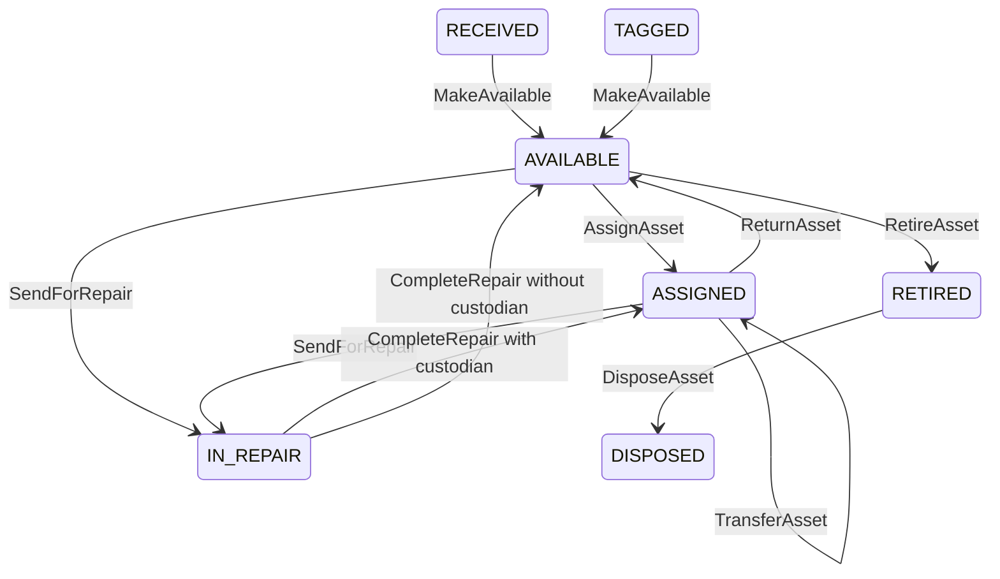

# Phase 4 — Asset lifecycle workflow and service contract

Asset Management runs as a Fiori List Report/Object Page module in the existing
`itoms.helpdesk` application. It shares the OData V4 model, preview server and
navigation with Help Desk. There is no second server or separately deployed app.

Open Help Desk and choose **Asset Management**, then **Go** to load the asset list.
Open an asset to see its warranty, current custodian, assignment intervals, repair
records, related tickets and lifecycle events. **My IT Assets** selects a simulated
employee and shows their current equipment, including equipment under repair.
My IT Support also provides a My IT Assets button. A ticket's **View requester**
page has an Assigned assets section whose rows open asset details.

## Lifecycle rules

Assets enter through synthetic RECEIVED/TAGGED fixtures in this phase. Creation,
tag allocation and editing master attributes are not exposed. Existing six assets
are retained and two intake examples have been added: IT-LAP-00502 and IT-LAP-00503.

All actions are bound to `ITOperations.Asset`, use
`POST /odata/v4/it-operations/Assets(<AssetUUID>)/ITOperations.<Action>`, and return
the updated asset. The service owns status, custodian, criticality, timestamps
and `Can<Action>` flags. There is no direct asset PATCH/DELETE/POST contract.

| Action | JSON input | Rules |
| --- | --- | --- |
| MakeAvailable | `{"Reason":"Inspection passed"}` | RECEIVED or TAGGED → AVAILABLE. |
| AssignAsset | `{"EmployeeUUID":"<UUID>","Reason":"Workstation allocation"}` | AVAILABLE → ASSIGNED; open an assignment and set location to employee location. |
| TransferAsset | `{"EmployeeUUID":"<UUID>","Reason":"Team transfer"}` | ASSIGNED only; new employee must differ; close old interval and open new one at the same time. |
| ReturnAsset | `{"Reason":"Returned to IT"}` | ASSIGNED → AVAILABLE; close assignment and clear custodian; retain last location. |
| SendForRepair | `{"TechnicianUUID":"<UUID>","TicketUUID":null,"Diagnosis":"Display failure"}` | AVAILABLE/ASSIGNED → IN_REPAIR; technician must be in IT Support; optional ticket must reference this asset. |
| CompleteRepair | `{"RepairDescription":"Replaced cable and verified"}` | Close the single open repair; return to ASSIGNED if custody exists, otherwise AVAILABLE. |
| RetireAsset | `{"Reason":"End of service life"}` | AVAILABLE → RETIRED; assigned assets must be returned first. |
| DisposeAsset | `{"Reason":"Disposal completed"}` | RETIRED → DISPOSED; no subsequent lifecycle actions. |

Reasons, diagnosis and repair description must contain 1–4000 characters after
trimming. Invalid input returns 400, missing asset 404, forbidden direct writes
405 and invalid state 409. The state is rechecked inside the shared write queue.

## Assignment and repair consistency

An asset with a CurrentEmployeeUUID must have exactly one open assignment with
the same employee. Without a custodian it has no open assignment. Custody is
allowed only in ASSIGNED or IN_REPAIR. Assignment end is exclusive; transfer
closes and opens intervals at one timestamp, avoiding overlapping custody.

Sending assigned equipment for repair retains its assignment. Completing repair
does not create a second assignment. Exactly one OPEN repair exists while the
asset is IN_REPAIR. Closed repairs retain diagnosis, technician, completion text
and timestamps. A later repair creates another record rather than overwriting
the previous one. Completing a repair does not resolve its linked ticket; Help
Desk retains its own confirmation and closure process. Inventory is Phase 5/6.

All asset actions record the demo supervisor EMP-0006 as actor. TechnicianUUID
records who is assigned to the repair, not authenticated execution identity.
Employee selection and department checks do not implement production security.

## Data dictionary additions

All three new sets reject external creation, update and deletion. Only lifecycle
code creates history and closes assignment/repair records. Existing fields on
Assets remain; `StatusCriticality` (Int32) and eight `Can<Action>` Boolean fields
are computed from asset status. Assets now support case-insensitive search.

### AssetAssignments / AssetAssignment

| Field | EDM type | Nullable | Purpose |
| --- | --- | --- | --- |
| AssetAssignmentUUID | Guid | No | Primary key. |
| AssetUUID | Guid | No | Associated asset. |
| EmployeeUUID | Guid | No | Custodian for this interval. |
| StartAt | DateTimeOffset | No | Beginning of custody. |
| EndAt | DateTimeOffset | Yes | End of custody; null means open. |
| Reason | String(4000) | No | Why the assignment started. |
| EndReason | String(4000) | Yes | Why it ended. |
| CreatedBy | String(80) | No | Simulated assigning actor. |
| ClosedBy | String(80) | Yes | Simulated ending actor. |

Navigation: `Asset` → Assets, `Employee` → Employees.

### AssetRepairs / AssetRepair

| Field | EDM type | Nullable | Purpose |
| --- | --- | --- | --- |
| AssetRepairUUID | Guid | No | Primary key. |
| AssetUUID | Guid | No | Associated asset. |
| TicketUUID | Guid | Yes | Optional ticket for the same asset. |
| TechnicianUUID | Guid | No | Eligible IT Support technician. |
| Status | String(20) | No | OPEN or COMPLETED. |
| Diagnosis | String(4000) | No | Recorded fault. |
| RepairDescription | String(4000) | Yes | Required when completed. |
| StartedAt | DateTimeOffset | No | Repair start time. |
| RepairedAt | DateTimeOffset | Yes | Repair completion time. |
| CreatedBy | String(80) | No | Simulated opening actor. |
| CompletedBy | String(80) | Yes | Simulated completing actor. |

Navigation: `Asset` → Assets, `Ticket` → Tickets, `Technician` → Employees.

### AssetHistory / AssetHistory

| Field | EDM type | Nullable | Purpose |
| --- | --- | --- | --- |
| AssetHistoryUUID | Guid | No | Primary key. |
| AssetUUID | Guid | No | Associated asset. |
| ActorUUID | Guid | No | Simulated action actor. |
| Action | String(40) | No | Lifecycle action or imported Baseline. |
| OldStatus | String(20) | Yes | Previous status; baseline may have none. |
| NewStatus | String(20) | No | Resulting status. |
| OldEmployeeUUID | Guid | Yes | Previous custodian. |
| NewEmployeeUUID | Guid | Yes | Resulting custodian. |
| Reason | String(4000) | No | Reason, diagnosis or repair description. |
| CreatedAt | DateTimeOffset | No | Event time. |

Navigation: `Asset`, `Actor`, `PreviousEmployee`, `NewEmployee`.
Assets expose `Assignments`, `Repairs` and `History` collections in addition to
`CurrentEmployee` and `Tickets`. Employees retain their `Assets` collection.
The service now has eight entity sets and 26 navigation properties.

## Local storage and transaction boundary

Canonical metadata and fixtures remain in `mock/`, synchronized into the app by
`npm run mock:sync`. There are 22 synchronized files and 82 synthetic seed records:
6 employees, 8 assets, 9 tickets, 14 comments, 31 ticket events, 4 assignments,
2 repairs and 8 asset events. Most asset events explicitly identify themselves as
imported baseline records; they do not claim a complete pre-import event ledger.

The existing shared Promise queue serializes both ticket and asset writes. Asset
operations validate all inputs before mutation, retain original rows, and undo
their child writes if a later step fails. Internal child writes require a Symbol
not representable in HTTP input. This is local compensation, not a durable
database transaction, OData changeset atomicity, ETag or RAP draft guarantee.

Data survives browser refresh but resets on server restart/fixture reload.
My IT Assets reads its collections in pages of 100 and uses a 10,000-row JSON-model
display limit; production scale still needs server-driven UI pagination.

## SAP continuation

Map AssetAssignments and AssetRepairs to the already planned ZIT_ASSET_ASSIGN and
ZIT_ASSET_REPAIR persistence and asset-owned RAP children. AssetHistory is an added
audit child, planned as ZIT_ASSET_HISTORY with ZI_IT_AssetHistory and
ZC_IT_AssetHistory projections, subject to target-system naming validation.

The asset RAP root must implement these actions with real identity, authorization,
locking and transactional history writes. Validate parameters, nullable ticket
references, dates, navigation, operation availability and side effects before
switching the shared service destination to SAP. No SAP backend was deployed.

## Walkthrough

1. Choose Asset Management → Go → IT-LAP-00502 (RECEIVED).
2. Make available with an inspection reason.
3. Assign asset to Ayesha Khan with an assignment reason.
4. Transfer asset to Bilal Ahmed; inspect both assignment intervals.
5. Send for repair to Omar Farooq with a diagnosis; leave ticket empty for this new asset.
6. Complete repair with the work performed; it returns to ASSIGNED.
7. Return asset, then retire it, then dispose it, providing a reason at each step.
8. Open IT-LAP-00452 to inspect its existing repair and related Help Desk ticket.
9. Open My IT Assets and switch employees to inspect equipment and the empty state.

The action dialogs provide employee/technician value help. For manual technical
testing, the seeded employee UUID suffixes are 001 Ayesha, 002 Bilal, 004 Omar and
005 Hina under the prefix `00000001-0000-4000-8000-000000000`.
