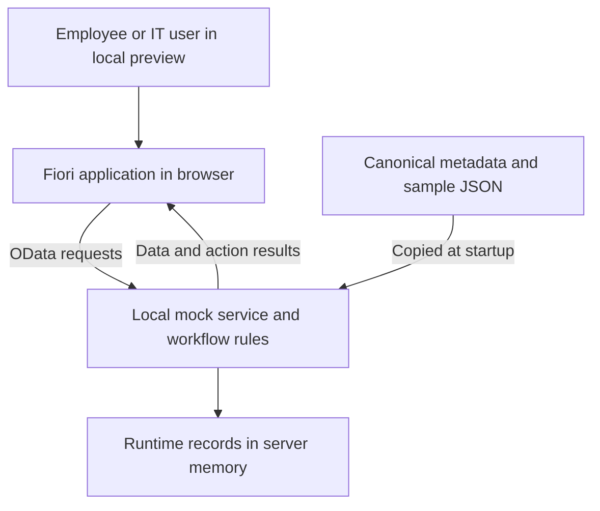
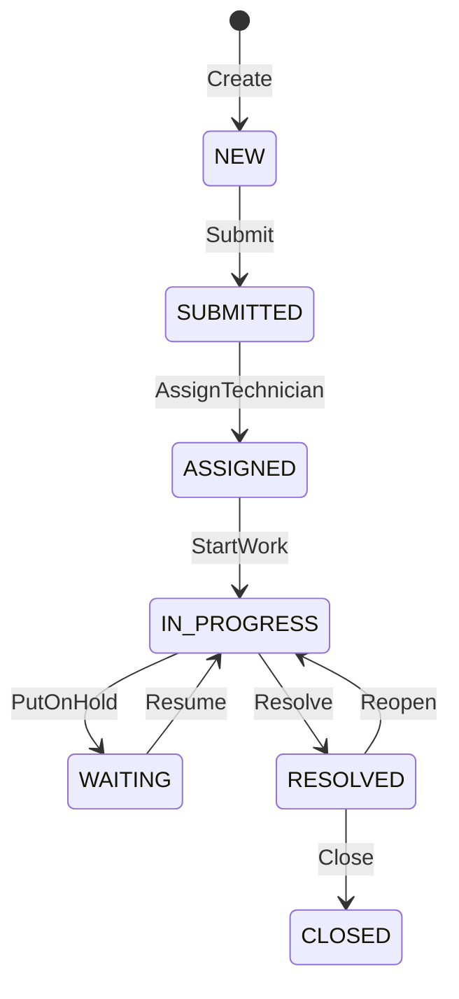
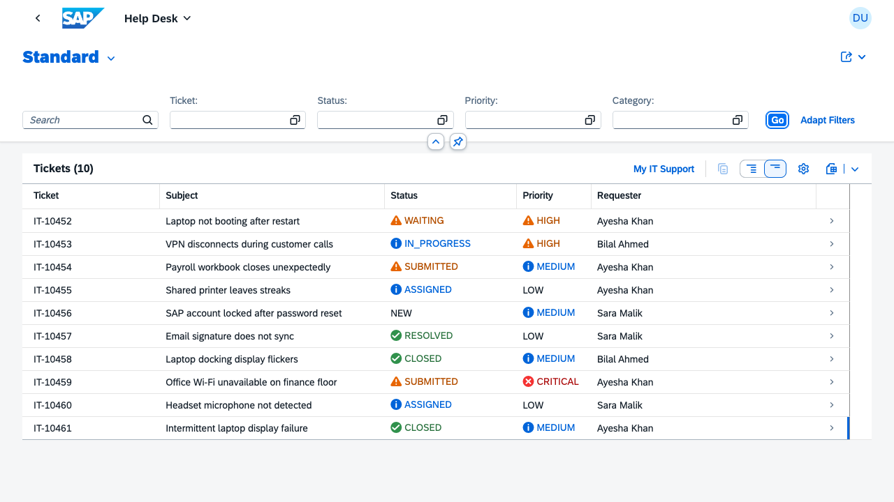

# SAP IT Operations: beginner teaching report for Phases 0–3

Prepared: **2 October 2026**. This guide explains the implementation in this repository through the completed **local Help Desk MVP**. MVP means minimum viable product: the first usable version of the core business process.

You do not need prior SAP development knowledge to follow the first walkthrough. Later sections introduce the code and service requests gradually. Commands are run from the project folder in a terminal. Code examples marked as examples explain the existing implementation; you do not need to paste them into source files.

## Learning route

1. Understand the business problem and the main technical terms.
2. Learn what Phase 0 established: architecture and project organization.
3. Learn what Phase 1 established: a working Fiori development environment.
4. Learn what Phase 2 established: data, relationships and a service contract.
5. Learn what Phase 3 added: ticket creation and controlled workflow actions.
6. Run the application and complete a ticket yourself.
7. Follow one request through the code and inspect the service.
8. Understand the tests, fixes, limitations and next phase.

## 1. What are we building?

Imagine an employee whose laptop stops working. They need to report the problem. IT needs to know who owns the laptop, who will investigate, what happened during the investigation and whether the employee accepted the solution.

The project connects three business areas:

| Area | Business question | Position at the end of Phase 3 |
| --- | --- | --- |
| Help Desk | Who reported a problem, and how is IT resolving it? | Local ticket creation and workflow implemented. |
| Asset management | Which physical device is involved and who uses it? | Reference data and ticket-to-asset detail navigation implemented; lifecycle management remains later work. |
| MIS inventory | Which spare parts are available and consumed during repairs? | Architecture planned; inventory operations are not implemented. |

The initial goal is one complete process: an employee creates a ticket, and IT opens and processes it. A future repair process will connect that ticket to spare-part reservation, issue and repair history. A sample ticket mentioning an SSD does **not** mean that inventory process already exists.

### Essential vocabulary

| Term | Meaning in this project |
| --- | --- |
| Frontend | The screens, forms and buttons in the browser. |
| Backend/service | The part that receives data requests and applies business rules. Today this is a local mock service. |
| SAP Fiori | The SAP application experience and design approach used by these screens. |
| SAPUI5 | The UI framework providing the controls and application runtime. |
| Fiori Elements | Templates that build standard pages from service metadata and UI annotations. |
| List Report | A searchable/filterable table of tickets. |
| Object Page | A detailed page for one selected ticket, including its related information and actions. |
| API | The interface through which the browser requests or changes data. |
| OData V4 | The service protocol used for entities, queries, relationships and actions. |
| Metadata/EDMX | The XML description of the service: entity names, fields, types, relationships and actions. |
| Annotation | Extra descriptive information that tells Fiori how to present data or operations. |
| Mock/fixture | A simulated service and its prepared sample records, used without a real SAP backend. |
| Entity/entity set | One type of business record, such as Ticket, and its collection, Tickets. |
| UUID | A technical identifier used to uniquely identify a record and link it to other records. |
| Validation | A check that rejects invalid input or an invalid operation. |
| Audit history | A record of what changed, when it changed and the recorded actor. |
| RAP | SAP's ABAP RESTful Application Programming Model, planned for the future backend. |
| CDS | Core Data Services, used in the planned SAP data-model and service design. |

### The system today



The browser runs on your computer and uses `localhost:8082`. “Localhost” means this computer. The port, `8082`, identifies this particular server. Port 8080 was already occupied, so this project uses 8082.

Runtime records are in memory. Refreshing the browser keeps newly created tickets; restarting the server or reloading fixtures resets them. There is no durable database yet.

## 2. Phase 0 — establish the foundation

**Question answered:** What are we building, how do its parts connect, and where will the work live?

### Step 1: organize the repository

A repository is the project folder plus its Git history. Git records versions of the source code. GitHub stores a remote copy of committed versions; running the local app does not automatically upload anything.

The existing repository was retained. Ignore rules exclude dependencies, generated builds, test output and local secrets. The README explains how to install, run and inspect the project.

| Folder/file | What to look for |
| --- | --- |
| `README.md` | Entry point and runnable commands. |
| `docs/` | Workflow, phases, architecture and completion reports. |
| `sap-design/` | Entity relationships, naming and future CDS/RAP design. |
| `apps/help-desk/` | The Fiori application. |
| `mock/` | Authoritative service metadata, sample records and local rules. |
| `scripts/` | Generation, synchronization and validation helpers. |
| `tests/` | Automated checks. |

### Step 2: describe the business objects before building screens

The initial model contains 11 conceptual entities:

| Entity | Example purpose |
| --- | --- |
| Employee | Ayesha Khan, who requests support. |
| Ticket | A report that her laptop is failing. |
| Asset | The physical laptop linked to the ticket. |
| TicketComment | A written diagnostic note. |
| TicketHistory | An event such as moving from SUBMITTED to ASSIGNED. |
| AssetAssignment | A record of equipment being assigned to an employee. |
| AssetRepair | A repair performed on equipment. |
| Material | A type of spare part, such as an SSD. |
| Stock | Quantity of a material at a storage location. |
| Reservation | Parts set aside for a request or repair. |
| StockTransaction | An auditable receipt, issue or other stock movement. |

Only the first five have service entity sets in the completed Phase 3 scope. Designing all 11 early makes later relationships explicit without claiming all 11 are implemented.

### Step 3: choose identifiers and relationships

A ticket has a technical `TicketUUID` and a readable `TicketNumber`, such as `IT-10452`. The readable number helps people discuss a ticket. The UUID identifies it in API requests and relationships.

`RequesterUUID` points to an employee. `AssetUUID` points to an asset if one is relevant. `TechnicianUUID` points to the assigned IT employee and can initially be empty.

A field pointing to another record is called a foreign key. A relationship described as “one employee can request many tickets” means the same employee UUID may appear on multiple tickets.

### Step 4: define decisions that later code must follow

Naming conventions establish consistent entity, field, key and service names. The architecture also states that employee confirmation closes a resolved ticket and that reopening returns a resolved ticket to IN_PROGRESS. Stock changes will eventually require transaction records instead of silently editing a quantity.

### Step 5: plan the SAP replacement

The design maps the local objects and operations to future tables, CDS views, RAP business objects and services. A business object groups the data and behavior of something such as a ticket.

This is a migration blueprint, not generated or deployed ABAP. Matching the future service to today's contract should reduce frontend rework, but backend integration and testing will still be required.

**Phase 0 result:** the repository, model, naming and architecture can explain how a ticket relates to an employee, asset and future inventory process.

**Read next:** [Architecture](architecture.md), [entity model](../sap-design/data-model/entities.md), [naming conventions](../sap-design/naming-conventions.md).

## 3. Phase 1 — make a Fiori application run locally

**Question answered:** Can a real Fiori application run on this machine before SAP backend access exists?

### Step 1: establish the development tools

| Tool | Why it is needed |
| --- | --- |
| VS Code/VS Code Insiders | Edit and navigate project files. |
| SAP Fiori tools | Support Fiori application development in the editor. |
| Node.js | Runs the local development tools and server. |
| npm | Installs project dependencies and runs named scripts. |
| Git | Tracks source-code versions. |
| Google Chrome | Runs the configured automated browser tests. |

Node 24.21.0 is pinned locally, with version files and a lockfile. The lockfile records resolved package versions so installs are reproducible. Project npm scripts use the locally installed Node runtime after dependencies are installed; the system Node installation was left unchanged.

### Step 2: generate the application scaffold

SAP's Fiori Elements writer generated `apps/help-desk`. A scaffold is a starting application with its component, configuration, routes and standard pages already connected.

The project uses SAPUI5 1.144.0 with the Horizon theme. It contains actual Fiori Elements List Report and Object Page templates. A custom employee intake page was added later in Phase 3.

### Step 3: configure the application files

| File/location under `apps/help-desk/` | Responsibility |
| --- | --- |
| `webapp/Component.js` | Starts the application component. |
| `webapp/manifest.json` | Declares models, service location, routes, page targets and custom actions. |
| `webapp/annotations/annotation.xml` | Describes list columns, detail sections, labels and action presentation. |
| `webapp/i18n/` | Holds user-facing text resources. |
| `ui5-mock.yaml` | Configures the local mock preview and middleware. |
| `webapp/localService/mainService/` | App-side copies of metadata, fixtures and mock code. |

Routing means deciding which page to show for a URL. Opening a ticket changes the route from the list to a ticket Object Page identified by its UUID.

### Step 4: verify the smallest useful example

Phase 1 used one synthetic `SETUP-001` ticket to prove the service, list and detail page worked together. That setup fixture was subsequently replaced by the richer Phase 2 dataset. Do not expect to find it in today's app.

**Phase 1 result:** a local Fiori preview, build and initial smoke tests worked without SAP credentials. The historical report recorded two passing tests at this stage.

## 4. Phase 2 — define realistic data and the service contract

**Question answered:** Can Fiori read consistent business records and follow their relationships?

### Step 1: define the contract in metadata

The canonical file is [mock/metadata.xml](../mock/metadata.xml). “Canonical” means this is the source to edit; its app-side copy is generated by synchronization.

Metadata declares field types and requirements. For example, a UUID field is an `Edm.Guid`, text is an `Edm.String`, and an audit timestamp is an `Edm.DateTimeOffset`. Nullability states whether a value may be absent.

`null` means “no value.” It is different from the text `"null"`. An unassigned technician is represented by a null reference, not a fabricated employee record.

### Step 2: supply deterministic sample records

Deterministic means the starting data is known and repeatable, rather than randomly different on each run.

| Entity set | Seed records | What they demonstrate |
| --- | ---: | --- |
| Employees | 6 | Requesters, technicians and a demo supervisor. |
| Assets | 6 | Equipment, assignment and optional warranty data. |
| Tickets | 9 | All seven statuses and four priorities. |
| TicketComments | 14 | Written diagnostic context. |
| TicketHistory | 31 | Recorded actions and status changes. |
| **Total** | **66** | A repeatable starting point for demonstrations and tests. |

The fixtures are synthetic. Names and email addresses do not represent live company data. Newly created tickets add runtime records; the table above describes the seed dataset.

The sample `IT-10452` connects requester Ayesha Khan, laptop `IT-LAP-00452`, technician Omar Farooq, diagnostic comments and waiting history.

### Step 3: add navigation relationships

The service defines 14 navigation properties. Navigation lets a client ask for a ticket's requester or history through the ticket itself rather than manually combining separate unrelated lists.

For example, a ticket can expose `Requester`, `Technician`, `Asset`, `Comments` and `History`. Reverse relationships also allow relevant employees or assets to expose related ticket collections.

### Step 4: keep the source and runtime copies synchronized

```sh
npm run mock:sync
npm run mock:check
npm run validate:contract
```

The first command copies source metadata, JSON and contributors into the application. The second checks that source and copies match. The third validates the seed records: types, required fields, lengths, references and other consistency rules.

Start/preview runs synchronization automatically. Tests run the parity check and fixture validation before the test suite. At Phase 3 completion, 14 files are synchronized; the historical Phase 2 report recorded 12 before the additional workflow helpers existed.

### Step 5: review and repair edge cases

Phase 2 received three independent agent reviews: contract/documentation, service/tests and Fiori/browser behavior. Their findings led to these fixes:

- Null comparisons were corrected so filters such as unassigned technician queries return the right records.
- Contributors retained the middleware's native JSON loading instead of caching fixture JSON through `require()`.
- Related employee labels became explicit: Requester, Technician, Author and Actor.
- Browser checks accounted for responsive tables hiding extra fields behind “Show More per Row.”

**Phase 2 result:** five entity sets, realistic data, relationships and Fiori reads passed 21 tests. This was a read-contract milestone; the business mutation rules came in Phase 3.

**Read next:** [Complete field dictionary](service-contract.md) and [Phase 2 review report](phase-2-report.md).

## 5. Phase 3 — implement the Help Desk workflow

**Question answered:** Can a person create a ticket and carry it through a controlled support process?

### Step 1: add My IT Support

The custom intake page lets a preview user select an employee, view that employee's tickets and create a new request. Its asset options include only that employee's assigned equipment or equipment under repair, plus “No specific asset.”

The form requires a subject and description. Category defaults to Hardware; priority defaults to MEDIUM. The page waits for employee data before allowing creation, displays errors and disables repeated creation clicks during the request.

Selecting a preview employee simulates identity. It does not log you in or enforce a production role.

### Step 2: let the service own important fields

The user supplies the problem description and references. The service generates the UUID, ticket number, NEW status, timestamps and audit values. Attempts to submit forged values for those service-owned fields are replaced by the service's values.

Validation checks that the requester exists, text is nonblank and within limits, category and priority are supported, and any selected asset belongs to the requester in an eligible state.

### Step 3: implement a state machine

A state machine is a set of allowed states and the operations that move between them. It prevents a new, unassigned ticket from being closed immediately.



| Button/action | Allowed starting status | Result | Required extra input |
| --- | --- | --- | --- |
| Create ticket | No ticket yet | NEW | Requester, subject, description, category; optional asset and priority. |
| Submit ticket | NEW | SUBMITTED | None. |
| Assign technician | SUBMITTED | ASSIGNED | UUID of an employee in IT Support. |
| Start work | ASSIGNED | IN_PROGRESS | None. |
| Put on hold | IN_PROGRESS | WAITING | Reason, 1–500 characters. |
| Resume work | WAITING | IN_PROGRESS | None. |
| Resolve ticket | IN_PROGRESS | RESOLVED | Resolution, 1–4000 characters. |
| Confirm and close | RESOLVED | CLOSED | None. |
| Reopen ticket | RESOLVED | IN_PROGRESS | Reason, 1–500 characters. |

Resolved means IT has supplied a solution. Closed means the requester has confirmed completion in the simulated process. CLOSED tickets cannot be reopened in this phase. Reassignment is also not implemented.

### Step 4: record history with each successful operation

Creation and every successful action append a history event with the action, old and new status, actor, timestamp and applicable reason. Reopening clears the current resolution but preserves the earlier resolution in history.

Actor values are simulated: the requester for creation/submission/closure/reopening; demo supervisor EMP-0006 for assignment; the assigned technician for work, hold, resume and resolution. These values are not proof of an authenticated person performing the action.

### Step 5: protect the workflow in the service

Buttons are shown according to computed `Can<Action>` flags. However, hiding a button alone would not protect data: a caller could send an API request directly. The service therefore checks the transition again.

Direct ticket PATCH and DELETE are rejected. Reference records, comments and history reject external writes. History can be appended through the internal workflow path. Local writes run in a queue so two simultaneous creates do not choose the same number and duplicate actions do not both succeed.

If a history insertion fails, the associated ticket change is restored. This local safeguard is not a full database transaction or a guarantee of atomic multi-operation OData batches.

### Step 6: add presentation and navigation

Status and priority carry service-derived criticality values. These drive standard SAP visual states while retaining readable text. CRITICAL priority is negative/error, HIGH is warning, MEDIUM is informational and LOW is neutral.

The Object Page provides **View requester** and **View asset**. The asset button is disabled when no asset is linked. These are reference detail pages, not a completed asset lifecycle application.

### Step 7: fix issues found during implementation

The stored ticket is cloned before updating it, preserving the genuine old status for history and rollback. New timestamps use whole-second precision to match metadata. Asset-button bindings use the UUID value without trying to format it directly as a Boolean. Employee creation waits until its required initial data has loaded. Ticket search compares text without case sensitivity.

**Phase 3 result:** the employee-to-support process works locally, with validation, navigation and audit history. The recorded completion suite has 28 passing tests.

## 6. Guided practical lesson: create and close a ticket

### Step 1: open the project terminal

Open the project folder in VS Code and choose **Terminal → New Terminal**. If needed, navigate to the existing folder:

```sh
cd "/Users/muneeburrehman/Desktop/Projects/SAP IT OPERATIONS"
```

Quotation marks preserve spaces in the folder name. On another machine, substitute that machine's project path.

### Step 2: install only if setting up a fresh checkout

With Node 24 LTS and npm available:

```sh
npm ci
```

This installs packages from the lockfile. It is not necessary before every server restart. If you use nvm, `nvm install` and `nvm use` read the project's version configuration first.

### Step 3: start the preview

```sh
npm run preview
```

Open [Help Desk preview](http://localhost:8082/test/flp.html#app-preview). Keep the server terminal running. `npm start` starts the same server without opening a browser. If the existing preview is already running, use it instead of starting a second copy.

Expected result: a SAP shell and Help Desk List Report. Choose **Go** to load the seeded tickets. Internet is needed for SAPUI5 resources even though business data is local.

### Step 4: inspect a sample before creating your own

Open **Laptop not booting after restart** (`IT-10452`). Read the details, comments and history. Use **View requester** and **View asset**, returning with the shell/browser back navigation. Expand responsive table details if some history fields are hidden.

This sample is already WAITING. Use a new ticket for the complete NEW-to-CLOSED lesson.

### Step 5: create a request

Choose **My IT Support**. Select **Ayesha Khan** and enter:

| Field | Teaching example |
| --- | --- |
| Subject | Laptop display turns black after sign-in |
| Category | Hardware |
| Affected asset | IT-LAP-00452 |
| Priority | Medium |
| Description | The display turns black after sign-in and returns after reconnecting the charger. |

Choose **Create ticket**. Expected result: its Object Page opens with status NEW and a generated ticket number. In untouched seed data the next number is IT-10461; if tickets already exist, it will be higher. Record the number so you can find it later.

### Step 6: submit and assign

Choose **Submit ticket**. Expected status: SUBMITTED.

Choose **Assign technician**. The parameter is TechnicianUUID. The metadata provides an employee value help restricted to IT Support. For a reproducible exercise, the browser acceptance test uses Omar Farooq's technical ID in the technician field:

```text
00000001-0000-4000-8000-000000000004
```

Confirm **Assign technician** in the dialog. Expected status: ASSIGNED, with Omar as technician. Hina Shah is the other seeded IT Support employee; Ayesha is a requester in Finance and is not an eligible technician.

### Step 7: work and resolve

Choose **Start work**. Expected status: IN_PROGRESS.

Choose **Resolve ticket** and enter a resolution such as “Replaced the charger and verified the display through three restart cycles.” Confirm the dialog. Expected status: RESOLVED, with resolution text and time recorded.

### Step 8: confirm completion

Choose **Confirm and close**. Expected status: CLOSED. Open History and look for Create, Submit, AssignTechnician, StartWork, Resolve and Close. Returning to Help Desk and choosing **Go** should show your ticket in the list.

You have now completed the Phase 3 main process. No spare-part stock was deducted and no real hardware repair record was created by these actions.

### Step 9: practise the alternate paths on a second ticket

Create, submit, assign and start another ticket. Choose **Put on hold**, provide “Waiting for the employee to bring the charger,” and verify WAITING. Choose **Resume work** and verify IN_PROGRESS.

Resolve it, then choose **Reopen ticket** with “The display failed again after restarting.” Verify IN_PROGRESS and that the previous resolution remains in history. Resolve again and close when finished. Reopen must occur before closure.

### Step 10: try validation deliberately

On a fresh intake form, choose Create without a subject or description. Expect an error and no new ticket. Supply the missing fields and try again. At the API level, an invalid status transition is rejected even if a caller bypasses the screen.

## 7. Follow a Create request through the code

Read these files in order; you do not need to understand every line initially.

1. [MySupport.view.xml](../apps/help-desk/webapp/ext/support/MySupport.view.xml) declares the labels, inputs and Create button. The button calls `.onCreate`.
2. [MySupport.controller.js](../apps/help-desk/webapp/ext/support/MySupport.controller.js) reads the form, checks required text and uses the OData model to create a ticket. A separate JSON model stores temporary UI state such as the selected employee, form values, busy state and errors.
3. [manifest.json](../apps/help-desk/webapp/manifest.json) connects that OData model to `/odata/v4/it-operations/` and declares page routes.
4. [Tickets.js](../mock/data/Tickets.js) receives creation in `addEntry`. It validates input and references, constructs service-owned values and inserts the ticket and Create history event.
5. [_workflow.js](../mock/data/_workflow.js) supplies shared transition rules, criticality, timestamps, validation helpers and the write queue.
6. On success, the controller clears the form and navigates to the new ticket's Object Page. On an error, it retains the entered form values and displays a message.

Later actions are declared in metadata and presented through Fiori annotations. Fiori can generate the action dialogs without a separate hand-written controller function for every button. `Tickets.js` handles them through `executeAction`.

The transition definition is deliberately small. For example, the existing rule `Submit: ['NEW', 'SUBMITTED']` means “Submit is allowed only from NEW and produces SUBMITTED.” The service compares the actual status before applying it.

Presentation belongs mainly in annotation/view files; shared business rules belong in the service contributor. When changing the canonical mock implementation, run synchronization so the app receives the change.

## 8. Learn the API with safe read-only requests

These commands inspect data without changing it. Keep the local server running and paste them into a second terminal. Single quotes prevent the shell interpreting `$` query parameters.

### Read metadata

```sh
curl 'http://localhost:8082/odata/v4/it-operations/$metadata'
```

Expected result: XML describing the service. It is the schema, not a list of tickets.

### Read two tickets and only three fields

```sh
curl 'http://localhost:8082/odata/v4/it-operations/Tickets?$top=2&$select=TicketNumber,Subject,Status'
```

`$top` limits the number of records; `$select` chooses fields. Expected result: JSON containing a `value` array of ticket records.

### Find high-priority tickets

```sh
curl --get 'http://localhost:8082/odata/v4/it-operations/Tickets' \
  --data-urlencode "\$filter=Priority eq 'HIGH'"
```

The backslash before `$filter` prevents shell variable substitution inside double quotes. `--data-urlencode` handles spaces and quotes in the query value.

### Include related data

```sh
curl 'http://localhost:8082/odata/v4/it-operations/Tickets?$top=1&$expand=Requester,Asset,History'
```

`$expand` includes related records in the response. `$orderby` sorts records, `$skip` skips records for paging, and `$count=true` requests a collection count. The standard Fiori list uses service queries to retrieve its data.

### Understand writes without executing an extra example

Creation uses `POST /odata/v4/it-operations/Tickets`. An action uses `POST /odata/v4/it-operations/Tickets(<TicketUUID>)/ITOperations.Submit`, for example. Here `<TicketUUID>` is a placeholder for the actual technical key, not the readable ticket number.

GET reads; POST creates or invokes actions in this contract. Direct PATCH and DELETE of tickets are deliberately blocked. Action payloads and all supported parameters are listed in the [workflow/API guide](help-desk-workflow.md).

| Error code | What it means here |
| --- | --- |
| 400 | Input is invalid, such as an ineligible technician or missing resolution. |
| 404 | The requested ticket does not exist. |
| 405 | The operation is disallowed, such as a direct ticket PATCH. |
| 409 | The current status does not allow the requested action. |

## 9. How completion was verified

Testing is evidence that specified scenarios work. It is not a claim that every production concern has been solved.

| Command | Purpose | Recorded Phase 3 result |
| --- | --- | --- |
| `npm run doctor` | Check runtime and core application/service configuration. | Passed. |
| `npm run mock:check` | Detect stale app-side mock copies. | 14 files matched. |
| `npm run validate:contract` | Validate the seed data against the contract and relationships. | 66 records passed. |
| `npm test` | Execute service, workflow and browser tests. | 28 tests passed. |
| `npm run build` | Produce optimized application output in `apps/help-desk/dist`. | Passed. |
| `git diff --check` | Detect whitespace errors in tracked changes. | Passed. |

Building produces deployment artifacts; it does not deploy the app to SAP or start a production backend.

The tests consist of 18 contract tests, 6 workflow tests and 4 preview/browser checks. Contract tests cover collections, keys, filters, sorting, paging, relationships and bad fixtures. Workflow tests check creation through closure, invalid inputs, hold/resume/reopen, mutation protection, concurrent requests and search. The browser workflow creates a ticket, visits requester and asset details, assigns and resolves it, closes it and finds it in Help Desk.

Workflow tests use separate mock `sap-client` namespaces so their mutations do not change the normal preview fixtures. This is test isolation, not production tenant security. Test totals in the older reports are historical: 2 in Phase 1, 21 in Phase 2 and 28 after Phase 3.



This screenshot is recorded acceptance evidence, not a live view of the current server. This teaching guide documents existing checks; it does not claim a new full test run was performed just to write the guide.

## 10. Common beginner problems

| Symptom | Explanation and next step |
| --- | --- |
| Browser cannot connect | Start the server and wait for “Server started”; use port 8082. |
| Port is already in use | A preview may already be running. Use that preview, or stop your known previous server with Ctrl+C before restarting. |
| Shell loads but UI resources fail | Check internet access; the preview obtains SAPUI5 resources from the CDN. |
| Ticket table is initially empty | Choose Go to execute the list query; also check active filters. |
| My ticket disappeared after restart | New records were held in memory. Restart restores fixture data. |
| An action button is missing | Check the current status against the transition table. Refresh stale data if needed. |
| View asset is disabled | The ticket has no affected asset; this is an allowed case. |
| My source-data edit is not visible | Edit canonical files under `mock/`, synchronize and restart the server if needed. Restart loses runtime-only tickets. |
| `mock:check` fails | Run `npm run mock:sync`, then repeat the check. |
| `npm` is not found or Node is incompatible | Install/use the documented Node 24 environment, then install dependencies. |
| Browser tests cannot launch | They are configured for Google Chrome; ensure it is installed. |
| Create validation fails | Supply subject/description and valid references. Maximum lengths are 200 and 4000 characters respectively. |

Do not fix a workflow problem by manually changing a runtime status or deleting audit history. Reproduce it with the allowed action and inspect its error message.

## 11. What is complete, and what remains?

| Complete through Phase 3 | Still outside the completed scope |
| --- | --- |
| Repository, architecture and naming baseline. | Full asset assignment/transfer/return/repair lifecycle. |
| Generated Fiori app and local preview. | Inventory receipt, reservation, issue and stock transactions. |
| Five-entity service contract and seed data. | Real SAP persistence, CDS/RAP implementation and deployment. |
| Employee ticket intake and support actions. | Authenticated identity and backend authorization. |
| Validation, audit history and reference navigation. | Production locking/ETags, drafts and full batch transaction guarantees. |
| Automated contract/workflow/browser checks. | SLA processing, escalation, analytics and notifications. |

Comments can be read but not added through this MVP. The intake page currently loads up to 100 employees, assets and tickets per query; larger datasets need paging. Runtime data resets on server restart or fixture reload.

The Phase 2 audit recorded 47 development dependency findings and zero production dependency findings at that time. Phase 3 did not change dependency versions or claim those findings were remediated. Those historical results are not a current security certification.

Checkpoint `ee96467` was pushed to `origin/main` and contains completed Phase 2 plus the initial Phase 3 work. The final Phase 3 fixes, tests and reports were added locally afterward. This teaching report does not imply those later changes have been committed or pushed.

The next planned phase is **Phase 4 — Asset Lifecycle MVP**, expanding the current asset reference detail into asset management, assignment and history features. Existing ticket-to-asset navigation is a starting point for that work.

## 12. Check your understanding

Try answering before reading the answer column.

| Question | Answer |
| --- | --- |
| Why have both TicketUUID and TicketNumber? | One is a technical identity for requests/relationships; the other is easy for people to read. |
| Is selecting Ayesha the same as logging in? | No. It selects a simulated requester in the local preview. |
| Why validate in both the form and service? | The form helps the user; the service also rejects invalid direct API requests. |
| Can a NEW ticket be resolved immediately? | No. It must be submitted, assigned and started first. |
| Why is history separate from the current status? | The current status tells us where the ticket is now; history explains how it got there. |
| Does browser refresh erase new tickets? | No. Server restart or fixture reload resets runtime data. |
| Does a passing build mean SAP deployment happened? | No. It means application build artifacts were produced successfully. |
| Which source should you edit for service metadata? | `mock/metadata.xml`, then synchronize its app-side copy. |
| Are all 11 planned entities implemented? | No. Five service entity sets are implemented through Phase 3. |

For a final practical checkpoint, create a ticket without an asset, submit it, assign a technician, start work, hold/resume it, resolve it and confirm closure. Explain each history event and why the asset button is disabled. Completing that exercise demonstrates understanding of the delivered local workflow.

## Source reports and deeper reading

This guide is based on repository source files and the recorded implementation reports, not on assumptions about a deployed SAP system.

- [Phase 0–1 completion report](phase-0-1-report.md)
- [Phase 2 completion and swarm review](phase-2-report.md)
- [Phase 3 completion report](phase-3-report.md)
- [Phase plan](phases.md)
- [Architecture](architecture.md)
- [Service contract and field dictionary](service-contract.md)
- [Workflow actions and API payloads](help-desk-workflow.md)
- [Mock maintenance](../mock/README.md)
- [Future RAP mapping](../sap-design/services/rap-mapping.md)
