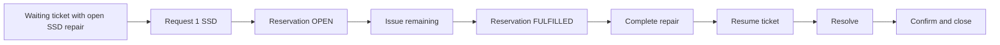

# Beginner guide — Phases 5 and 6, manually

This guide has two paths: **Part A** teaches how to perform the business workflows
in the finished preview; **Part B** teaches how the implementation was assembled
so you can reproduce it yourself. It continues the
[Phases 0–3 guide](beginner-guide-phases-0-3.md) and
[Phase 4 asset guide](asset-lifecycle.md).

The app is a local mock. Choose employees/technicians to simulate a role; there is
no login-based permission enforcement yet. Changes survive browser refresh but
reset when the mock server restarts or fixtures reload.

## Part A — Operate the application

### 1. Start your environment

Open a terminal in the project root:

```bash
npm ci
npm run doctor
npm run preview
```

If dependencies are already installed, use `npm run preview` directly. If the
preview is already running on 8082, reuse it. Open
**http://localhost:8082/test/flp.html#app-preview**. Press **Go** to load a List Report.
The initial “Let's get some results” message means no search has run yet.

### 2. Understand the three quantities

Think of ten SSDs on a shelf. Reserving two promises them to a repair:

| Moment | Physical | Reserved | Available |
| --- | ---: | ---: | ---: |
| Before request | 10 | 0 | 10 |
| Reserve 2 | 10 | 2 | 8 |
| Issue 1 of those 2 | 9 | 1 | 8 |
| Cancel the remaining 1 | 9 | 0 | 9 |
| Return the issued 1 | 10 | 0 | 10 |

Reservation does not remove an item from the shelf. Issue does. Cancelling releases
only an unissued promise. Return adds a previously issued item back to stock.

### 3. Find a material and its stock

1. In Help Desk, choose **MIS Inventory**.
2. Press **Go** on Materials.
3. Open **SSD-512**.
4. In **Stock by location**, open **Karachi IT Store**.
5. Read physical, reserved, available and reorder-level values.

Seed data includes SSDs at Karachi and Lahore, USB-C docking cables and Cat6 cable
measured in metres. Stock figures change as you perform the examples.

### 4. Receive stock

1. On the SSD stock Object Page choose **Receive stock**.
2. Enter Quantity `2` and Reason `Delivery inspected`.
3. Confirm **Receive stock**.
4. Physical and available quantities increase by two. Reserved stays unchanged.
5. Inspect **Movement history**: a RECEIVE record explains the increase.

You cannot type a new physical balance directly into the stock page.

### 5. Reserve, partially issue and cancel

1. Choose **Reserve stock**. Enter Quantity `2` and a reason such as `Bench repair`.
2. Leave optional ticket, asset and repair references empty for this standalone exercise.
3. Confirm. Physical stays the same; reserved increases and available decreases.
4. Open the new OPEN reservation from the stock's **Reservations** section.
5. Choose **Issue reservation**, Quantity `1`, Reason `Handed to technician`.
6. Confirm. Status becomes PARTIAL; issued is one and remaining is one.
7. Choose **Cancel reservation**, supplying a reason.
8. Status becomes CANCELLED. The unissued one is released; the issued one remains
   recorded. It is not silently put back on the shelf.

For a full issue, issue the entire remaining quantity instead of cancelling it;
status becomes FULFILLED. Both terminal states reject another issue.

### 6. Return an issued item

1. Open the reservation's movement history and identify the ISSUE record.
2. Open its Movement details and copy the Movement ID from its key/URL if needed.
3. Return to the stock location that issued the item.
4. Choose **Return stock**, select the **Original issue** using value help (or enter
   its UUID), enter Quantity `1` and a reason.
5. Confirm and inspect the RETURN movement and original issue reference.

Returns are capped at the original issue quantity minus prior returns. The reservation
does not reopen: use a new reservation for a later need.

### 7. Transfer between locations

1. On Karachi SSD stock choose **Transfer stock**.
2. Select the Lahore SSD stock as Destination stock using value help.
3. Enter Quantity `1` and a reason.
4. Confirm. Karachi physical stock decreases; Lahore physical stock increases.
5. Inspect the TRANSFER_OUT and TRANSFER_IN movements. Their TransferUUID matches.

You cannot transfer a different material or consume quantity already reserved.
The destination must be an existing stock location for the same material.

### 8. Adjust and inspect low stock

1. Choose **Adjust stock** and enter a signed correction, for example `-1`.
2. Supply an explanation such as `Damaged item removed after count`.
3. Confirm and inspect the ADJUST movement.
4. Open **Stock overview → Go**. Use the Low stock filter or compare Available
   quantity with Reorder level. At/below threshold is low stock; zero is critical.

Adjustments cannot make physical less than reserved or below zero. This preview
simulates the actor; production adjustment authorization remains RAP work.

### 9. Complete the flagship SSD scenario

For a fresh demonstration, start with the seeded **IT-10452 — Laptop not booting
after restart**. It is WAITING, references Ayesha's **IT-LAP-00452**, and already
has an OPEN repair diagnosed as SSD failure.

1. Open the ticket from Help Desk.
2. Choose **Repair workflow**. If it is hidden, open the header's **Additional Options (⋯)** menu first.
3. Inspect the open diagnosis. Starting another repair is disabled because one exists.
4. Under **Request part**, select **SSD-512 — Karachi IT Store**.
5. Enter Quantity `1` and Reason `Replace failed boot drive`.
6. Choose **Request part**. A linked OPEN reservation appears.
7. **Complete repair** remains disabled while quantity is outstanding.
8. As the simulated store officer, choose **Issue remaining** on that request.
9. The request becomes FULFILLED. Stock decreases and an ISSUE movement retains
   ticket, asset, reservation and repair references.
10. Enter Work performed: `Installed SSD, restored operating system and verified boot`.
11. Choose **Complete repair**. The asset returns to ASSIGNED because Ayesha retains custody.
12. Choose **View ticket**, then **Resume work** because the seeded ticket was WAITING.
13. Choose **Resolve ticket** and enter resolution notes.
14. Choose **Confirm and close** to simulate employee confirmation.
15. Inspect ticket History, Part requests and Part movements. Open the asset to see
    completed Repair history and related part events.



To practise from creation instead, use **My IT Support**, choose Bilal and his
IT-LAP-00318 asset, create/submit a hardware ticket, assign an IT Support technician,
and **Start work**. In Repair workflow, enter a diagnosis and **Start repair** before
requesting the SSD. Continue from step 4. Check the asset tag in your current fixture
if you have previously changed custody.

### 10. Practise error cases safely

- Reserve more than available: an error appears and balances stay unchanged.
- Enter `0`, a negative receipt, or fractional `EA`: validation rejects it.
- Try a four-decimal quantity: validation rejects the precision.
- Try completing repair with an outstanding request: issue or cancel first.
- Try resolving a ticket with an open repair: complete the repair first.
- Need a part with no available stock: place the ticket on hold, receive stock,
  retry the request and resume when work can continue.

## Part B — Build the implementation yourself

### 11. Use an isolated practice copy

The working implementation is already present. Do not overwrite it to follow the
exercise. A separate branch/worktree from the Phase 4 checkpoint `36c3cf2` lets you
rebuild these phases while comparing with the completed source. Configure another
port and live-reload port if you run both previews at once.

From the completed project's root, run these commands to create that separate copy:

```bash
git worktree add ../itoms-phase56-practice -b practice/phase56 36c3cf2
cd ../itoms-phase56-practice
npm ci
```

Use the original folder as your reference and edit only the practice folder.
Before starting its server, change `8082` to an unused port such as `8083` in
`apps/help-desk/package.json` and use a different live-reload port in the UI5
configuration. Alternatively, run only one preview at a time. The Phase 4 copy
will not contain inventory until you perform the steps below.

### 12. Define the data before the screen

Read [inventory-workflow.md](inventory-workflow.md). Write down:

1. Material identifies the item and its unit.
2. Stock identifies one material at one location.
3. Reservation promises stock to a need, optionally a ticket/repair.
4. StockTransaction explains a stock change and cannot be edited by users.

Add these four entity types and sets to `mock/metadata.xml`. Use UUID keys and
Decimal(15,3) quantities. Add parent/child navigation and entity-set bindings.
Give optional references nullable Guid types. Define action parameters and return
types. Compare your EDMX against the completed file rather than inventing field names.

For example, this property defines a quantity with twelve whole digits and up to
three decimal places. `Nullable="false"` means every record must supply it:

```xml
<Property Name="PhysicalQuantity" Type="Edm.Decimal"
          Nullable="false" Precision="15" Scale="3"/>
```

An entity type describes one row; an entity set exposes the collection at a URL.
For example, `Stocks` exposes Stock rows at `/odata/v4/it-operations/Stocks`.
Navigation properties connect those rows to material, reservation and movement rows.

### 13. Seed a ledger that balances

Create the four JSON fixtures in `mock/data/`. Begin with materials and stock
locations, then reservations and movements. Make opening quantities RECEIVE records.
For every stock row, sum PhysicalDelta and ReservedDelta across its movements;
the totals must equal the stored balances. Use valid existing ticket, asset and
repair UUIDs for linked examples.

Run `npm run mock:sync` after canonical changes. Never edit only the app's copied
`localService` files, because the next sync will replace them.

### 14. Implement quantities and state rules

Read `mock/data/_inventory.js` in this order:

1. `units()` validates a decimal and converts it to integer thousandths.
2. `decimal()` formats the result to three decimal places.
3. `decorateStock()` derives available stock, low-stock flag and criticality.
4. `decorateReservation()` derives outstanding quantity and allowed buttons.
5. `execute()` loads records and validates references before mutation.
6. `changeStock()` rejects negative available stock and overflow.
7. `movement()` constructs the immutable explanation of each change.
8. `commit()` applies the journal and compensates in reverse on failure.

Never trust a button's enabled state as validation. Repeat eligibility checks on
the backend, inside the shared queue, because another request can change stock.

### 15. Connect contributors and protect direct writes

`Stocks.js` and `Reservations.js` delegate their bound actions to `_inventory.js`.
`Materials.js` is read-only. StockTransactions permits internal journal insertion
and rollback but rejects direct HTTP writes. Internal writes use the existing
Symbol token; clients cannot manufacture it in JSON.

RequestPart is dispatched from `Tickets.js` before its regular ticket-action queue
wrapper so the inventory handler acquires that shared queue exactly once. Nesting
another serialized operation inside the same queue would deadlock.

### 16. Connect ticket and repair consistency

RequestPart derives the ticket's affected asset and matching open repair. Inventory
movements and reservations retain those keys. Append ticket and asset events in
the same local operation journal. Add the completion guards to `Assets.js` and
`Tickets.js`: outstanding parts block repair completion; open repairs or part
requests block ticket resolution.

### 17. Validate before building pages

Extend `scripts/validate-contract.mjs` for decimals, new sets and ledger rules.
Extend the contract test set list and add `tests/inventory.spec.cjs`.
Run:

```bash
npm run mock:sync
npm run validate:contract
npm exec playwright test tests/inventory.spec.cjs tests/contract.spec.cjs
```

The tests demonstrate positive flows, rejected changes, concurrency and rollback.
Use the API response body when an assertion fails; do not weaken a stock rule to
make the frontend test pass.

### 18. Build the Fiori templates

In `webapp/annotations/annotation.xml`, add HeaderInfo, LineItem, SelectionFields,
FieldGroup, Facets and Identification actions for the four new entity types.
Connect quantity criticality, labels and related collections. In `manifest.json`,
add List Report and Object Page routes/targets and their navigation mappings.

Add MIS Inventory buttons in `ext/Navigation.js`, and inventory row handling in
`ext/RelatedNavigation.controller.js`. Use Common.ValueList metadata for GUID
action parameters so users can select records instead of memorizing UUIDs.

A column is a `UI.DataField` inside `UI.LineItem`. This small example displays
the material number from the current row:

```xml
<Annotation Term="UI.LineItem">
  <Collection>
    <Record Type="UI.DataField">
      <PropertyValue Property="Value" Path="MaterialNumber"/>
      <PropertyValue Property="Label" String="Material"/>
    </Record>
  </Collection>
</Annotation>
```

Place it under the Material annotation target, then add the other columns from
the finished source. The route chooses the entity set; the annotation chooses
the columns; the OData binding retrieves the rows. You do not manually generate
HTML table rows for a Fiori Elements List Report.

### 19. Build the guided repair page

Read `ext/inventory/RepairWorkspace.view.xml` beside its controller:

- XML declares SAP controls and binds them to the named `repair` JSON model.
- The controller obtains ticket context from routing and reads related records
  through the default OData model.
- The stock selector displays material, location, available quantity and unit.
- Buttons execute bound OData actions, then refresh the related records.
- Backend errors appear on the page; loading state prevents duplicate clicks.
- Responsive columns become mobile pop-ins rather than overflowing the viewport.

The JSON model is UI state, not a second database. Saving happens only through
successful service actions. Add all new text to both i18n bundles.

### 20. Verify and document

```bash
npm test
npm run build
npm run doctor
git diff --check
```

Use the preview manually at desktop and phone widths. Verify the stock ledger,
reservation state and repair references in addition to visual appearance. Capture
evidence and update the completion report and project architecture. The next phase
is SLA, escalation and configuration; ABAP implementation remains later work.
