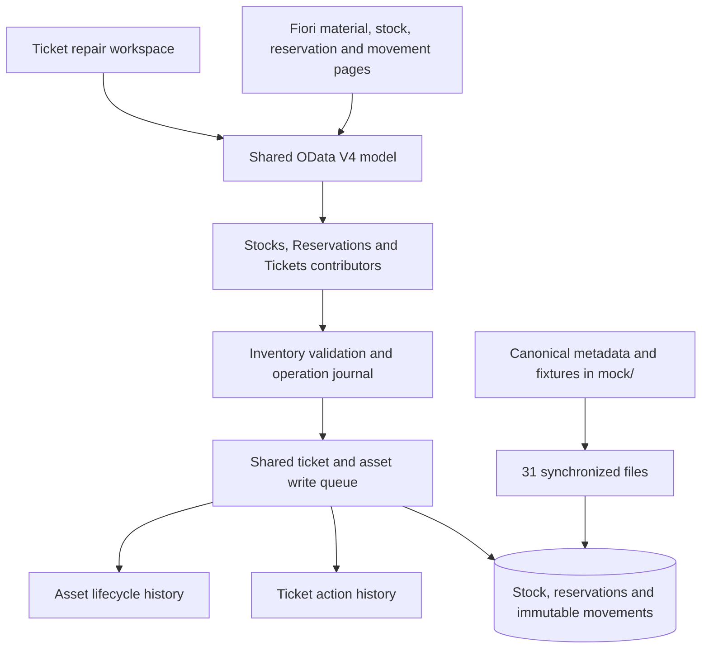
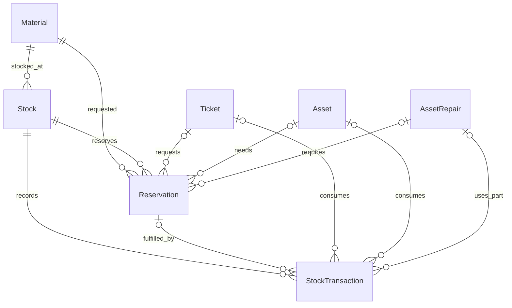
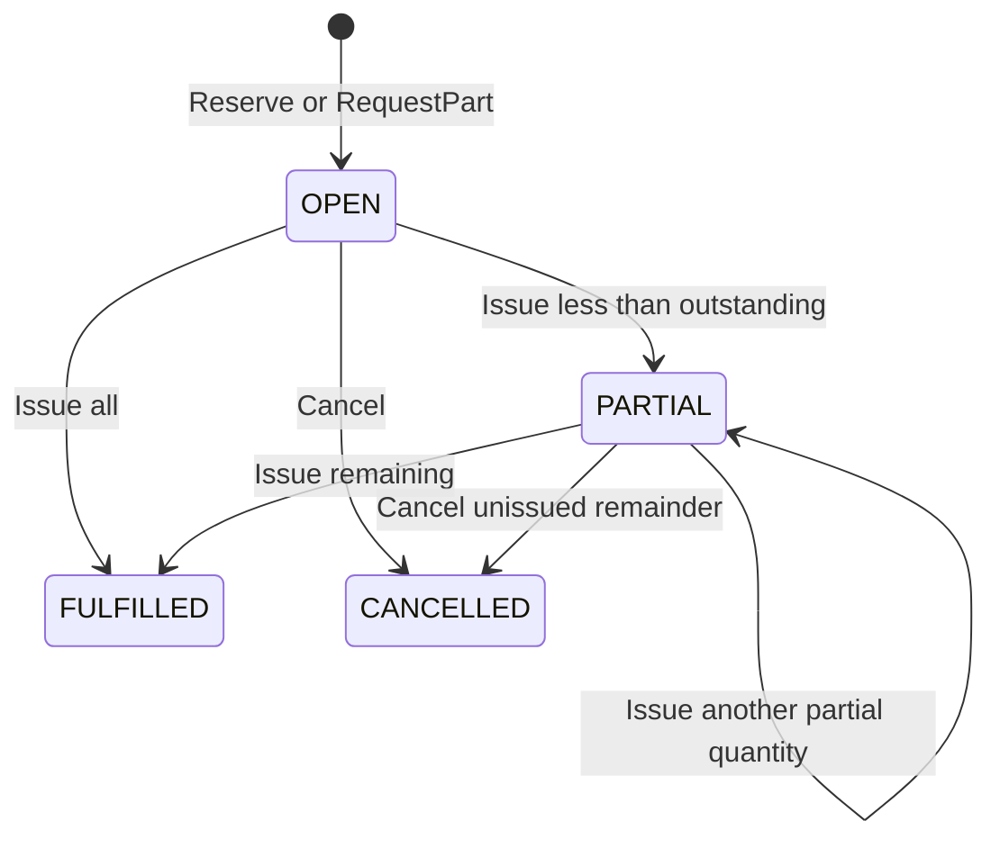
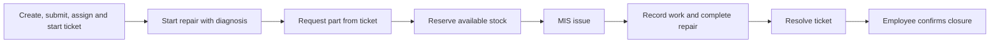

# Phases 5–6 — Inventory and integrated repair contract

Implemented locally on 7 October 2026. MIS Inventory and Repair workflow are
modules of the existing `itoms.helpdesk` component. They use the same OData V4
model, service root and serialized write queue as Help Desk and Asset Management.
This is an in-memory mock implementation; the RAP mappings remain a blueprint.

## Architecture



The complete service now contains **12 sets, 50 navigation properties and 99 seed
records**. Existing 82 Phase 4 records remain; additions are 3 materials, 4 stock
locations, 2 reservations and 8 movements. The opening stock is itself represented
by RECEIVE movements, so balances reconcile to the ledger from zero.

## Quantities and invariants

- `AvailableQuantity = PhysicalQuantity − ReservedQuantity`.
- `ReservedQuantity` equals the outstanding quantities of OPEN/PARTIAL reservations.
- Decimal quantities use `Edm.Decimal(15,3)` and fixed three-place strings in fixtures.
  Arithmetic uses integer thousandths, avoiding repeated binary fractional addition.
- `EA` requires whole units; `M` supports up to three decimal places.
- Positive, nonzero quantities are required, except AdjustStock accepts a signed,
  nonzero delta. Overflow and quantities that would consume reserved stock are rejected.
- `LowStock` is true when available quantity is at or below ReorderLevel.
  Criticality is negative at zero, warning at/below the threshold and positive otherwise.
- Stock is unique per MaterialUUID plus StorageLocation.
- A transfer has two opposite physical movements with one TransferUUID.
- Returns reference an original ISSUE in the same stock location. Total returns
  cannot exceed that issue. Returning does not reopen or reduce the fulfilled reservation.
- Cancelling a partially issued reservation releases only its unissued remainder.
- Ticket, asset, repair, material, stock and reservation references must agree.
- Direct POST/PATCH/DELETE on all four new sets is rejected. Actions own the balances.

## Entity dictionary

All UUID fields use Edm.Guid. Quantities use Decimal(15,3); audit time uses
DateTimeOffset. Required properties have explicit values; optional references use
null, not empty strings. The canonical EDMX contains exact type/length declarations.

| Set | Properties |
| --- | --- |
| Materials | MaterialUUID (key), MaterialNumber (business identifier), Description, Category, UnitOfMeasure |
| Stocks | StockUUID (key), MaterialUUID, StockLabel, StorageLocation, UnitOfMeasure, PhysicalQuantity, ReservedQuantity, AvailableQuantity, ReorderLevel, LowStock, StockCriticality, LastChangedAt |
| Reservations | ReservationUUID (key), MaterialUUID, StockUUID, TicketUUID?, AssetUUID?, AssetRepairUUID?, Quantity, IssuedQuantity, OutstandingQuantity, Status, Reason, CancelReason?, CreatedAt, CreatedBy, LastChangedAt, CanIssueReservation, CanCancelReservation |
| StockTransactions | StockTransactionUUID (key), MaterialUUID, StockUUID, ReservationUUID?, TicketUUID?, AssetUUID?, AssetRepairUUID?, MovementType, Quantity, PhysicalDelta, ReservedDelta, UnitOfMeasure, TransferUUID?, OriginalTransactionUUID?, Reason, CreatedAt, CreatedBy |

Stocks expose Material, Reservations and StockTransactions. Materials expose Stocks,
Reservations and StockTransactions. Reservations expose Material, Stock, Ticket,
Asset, Repair and Transactions. Movements expose Material, Stock, Reservation,
Ticket, Asset and Repair. Tickets, Assets and AssetRepairs expose reverse inventory
collections. OriginalTransactionUUID is a ledger reference validated by rules,
not an additional OData navigation property.



## Bound action API

Service root: `/odata/v4/it-operations/`. Endpoint form:
`POST <Set>(<UUID>)/ITOperations.<Action>`.
Reasons require **1–500 trimmed characters**. Quantity may be supplied as a decimal
string; values with more than three fractional places are rejected.

| Set / action | Parameters | Result and effect |
| --- | --- | --- |
| Stocks / ReceiveStock | Quantity, Reason | Updated Stock; positive physical movement |
| Stocks / ReserveStock | Quantity, Reason; optional TicketUUID, AssetUUID, AssetRepairUUID | Updated Stock; new reservation and RESERVE movement |
| Stocks / TransferStock | TargetStockUUID, Quantity, Reason | Updated source Stock; transfer to existing location for the same material |
| Stocks / ReturnStock | IssueTransactionUUID, Quantity, Reason | Updated Stock; RETURN linked to original issue |
| Stocks / AdjustStock | Quantity, Reason | Updated Stock; signed physical delta |
| Reservations / IssueReservation | Quantity, Reason | Updated Reservation; physical and reserved quantities decrease together |
| Reservations / CancelReservation | Reason | Updated Reservation; release unissued remainder |
| Tickets / RequestPart | StockUUID, Quantity, Reason | Ticket returned; new linked reservation and history |

Stock reservation with an asset requires its open repair reference. If a ticket is
provided, its affected asset determines the link; supplied conflicting references
are rejected. RequestPart derives the ticket/asset automatically and finds that
ticket's open repair. For a ticket without an asset, a general part request is
allowed without a repair reference. Ticket parts can be requested/issued only
while IN_PROGRESS or WAITING.

Example standalone stock receipt (replace the UUID with the required stock key):

```http
POST /odata/v4/it-operations/Stocks(00000010-0000-4000-8000-000000000001)/ITOperations.ReceiveStock
Content-Type: application/json

{"Quantity":"2.000","Reason":"Delivery inspected"}
```

Example ticket part request:

```json
{
  "StockUUID": "00000010-0000-4000-8000-000000000001",
  "Quantity": "1.000",
  "Reason": "Replace failed SSD"
}
```

Invalid input returns 400, missing references 404, forbidden direct writes 405,
and state/availability conflicts 409. Reads support the existing OData contract
operations. Value help is declared for stock, ticket, asset, repair and issue keys.
Selection is still validated server-side.

## Reservation lifecycle



Reservations do not expire automatically. No amendment/reopen action is provided;
cancel the remainder and create a new request when the requirement changes.

## Integrated repair flow



Open **Repair workflow** from a ticket. Start repair uses the ticket's asset,
technician and UUID with the existing SendForRepair action. Request part invokes
the new bound ticket action. **Issue remaining** issues the full outstanding
quantity; open the reservation Object Page for partial issue or cancellation.
Complete repair invokes the existing asset action and preserves custody rules.

PartRequested, PartIssued, PartCancelled and PartReturned append ticket and asset
history where references exist. Movements retain the repair UUID. Completing a
repair is blocked until its outstanding reservations are issued or cancelled.
Resolving a ticket is blocked while linked repairs or reservations remain open.
Repair completion, ticket resolution and employee closure remain separate actions.

An unavailable part is rejected without a reservation. The technician can put the
ticket on hold, arrange stock receipt, then retry the request and resume work.
There is no procurement/backorder automation or automatic ticket resumption.

## UI structure

| Route | Implementation |
| --- | --- |
| Materials / Materials(key) | Fiori Elements List Report / Object Page |
| Stocks / Stocks(key) | Stock overview / Object Page with stock actions |
| Reservations / Reservations(key) | Reservation list / issue and cancel actions |
| StockTransactions / StockTransactions(key) | Movement list / immutable movement details |
| Repair?ticket=UUID | Custom XML repair workspace using the shared OData model |

Material details show stock by location and movement/reservation history. Ticket
and asset Object Pages also show Part requests and Part movements. Related-table
navigation opens canonical object routes. The custom workspace has loading/error
states and responsive tables with mobile pop-ins.

## Transaction boundaries and limits

Inventory shares the same serialized queue as ticket and asset actions. A journal
records original rows, then applies stock/reservation/movement/history writes.
On failure, operations are compensated in reverse order, including an insertion
that throws after modifying storage. If compensation also fails, the error requires
restarting the local mock to restore its fixtures. This is not durable database
atomicity, distributed locking, ETags or full OData changeset rollback.

EMP-0006 is the simulated actor for inventory. The technician/store controls are
visible in one preview workspace; production role separation is not implemented.
Masters, storage locations and reorder thresholds are supplied by fixtures; their
maintenance UI is outside these milestones. No purchasing, supplier management,
valuation, cost accounting, lot/serial tracking or stocktake approval is claimed.
The custom workspace reads in pages of 100 and uses a 10,000-row JSON display limit.
Data resets on mock server restart/fixture reload.

## RAP continuation

Map Materials/Stocks/Reservations/StockTransactions to the planned
ZIT_MATERIAL/ZIT_STOCK/ZIT_RESERVATION/ZIT_STOCK_TXN tables, or integrate the released
standard inventory source when SAP owns stock. Project public aliases and action
signatures deliberately. Implement real identity, authorization, stock locking,
decimal/units rules and atomic stock/reservation/movement/audit writes in RAP.
Cross-root ticket/asset orchestration must use supported transaction mechanisms.
The local journal is a specification of expected outcomes, not deployable ABAP.
