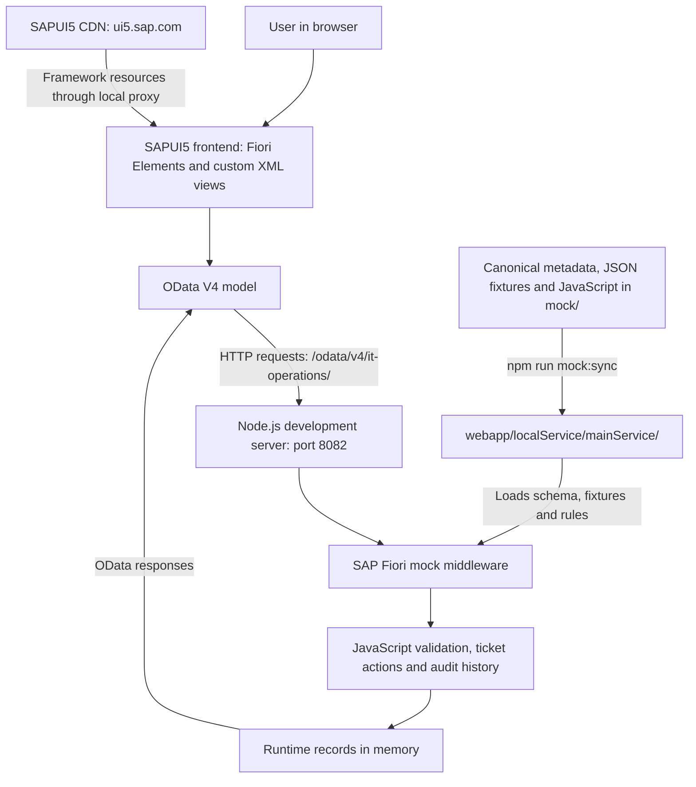

# Mock application architecture — frontend, backend and connections

This guide describes the Phase 3 architecture baseline. Phase 4 extends the same
application with Asset Management routes, My IT Assets, three asset-history entity
sets and eight lifecycle actions; see the [Phase 4 contract](asset-lifecycle.md)
for the current additions and record counts. The baseline descriptions below retain
the Phase 3 scope for teaching.

The project has a **SAPUI5/Fiori frontend connected to a Node.js mock backend through OData V4**. Both are served locally on port **8082**. The backend stores runtime changes in memory; there is no database or running SAP ABAP system.

## Architecture overview



## 1. Frontend technologies

The frontend is the part you see and interact with in Chrome.

| Technology | Role in this project |
| --- | --- |
| SAPUI5 1.144.0 | Provides tables, buttons, inputs, forms and dialogs. |
| SAP Fiori Elements | Creates standard List Report and Object Page screens from metadata, annotations and configuration. |
| SAP Horizon theme | Provides the SAP visual appearance. |
| XML views | Define manually built screens and controls, including the practice table. |
| JavaScript | Handles events, validation, navigation and data loading in custom pages. |
| OData V4 model | Communicates with the backend and binds returned records to controls. |
| JSONModel | Holds temporary UI state such as form values, selected employee and error messages. |
| ResourceModel / i18n files | Supplies labels and messages from text resource files. |

The application combines generated and manually written interfaces:

| Screen | Implementation |
| --- | --- |
| Help Desk ticket list | `sap.fe.templates.ListReport` |
| Ticket detail page | `sap.fe.templates.ObjectPage` |
| Requester and asset detail pages | Additional Object Page targets |
| My IT Support | Custom XML view hosted through the Fiori flexible programming model |
| Practice table | Manually written `sap.m.Table` inside My IT Support |

There is currently **one application**, `apps/help-desk`, containing these pages. The future asset and inventory applications are not yet separate implemented apps.

## 2. How the frontend files work together

The key frontend files are under `apps/help-desk/webapp/`.

| File | Responsibility |
| --- | --- |
| `Component.js` | Starts the application using SAP's Fiori application component. |
| `manifest.json` | Defines the service connection, models, routes, page templates and custom actions. |
| `annotations/annotation.xml` | Defines table columns, filters, detail sections, labels and action presentation. |
| `ext/support/MySupport.view.xml` | Defines the employee form, My tickets table and practice table. |
| `ext/support/MySupport.controller.js` | Loads employee data, handles creation and opens tickets. |
| `ext/Navigation.js` | Handles custom navigation between pages. |
| `i18n/i18n.properties` | Contains user-facing text. |

For the main Help Desk table, the responsibilities are:

```text
metadata.xml
    Defines that Ticket has Subject, Status, Priority, etc.

annotation.xml
    Defines which fields appear as columns and filters.

manifest.json
    Selects ListReport and connects it to /Tickets.

Fiori Elements
    Builds and operates the resulting page.
```

For a manual table, you supply the columns and row controls directly. This XML opening tag demonstrates the collection binding:

```xml
<Table items="{/Tickets}">
```

That binding tells SAPUI5 to obtain the `Tickets` collection from the default model. Each row then reads properties such as `{Subject}`.

## 3. Backend technologies

The current backend is a local simulation with real validation and workflow code.

| Technology | Role |
| --- | --- |
| Node.js 24.21.0 | Runs the development server and mock-service code. |
| SAP UX UI5 tooling 1.32.0 | Provides the `fiori run` development command and preview middleware. |
| SAP FE mock middleware 2.4.17 | Exposes the local OData service, reads metadata and serves records. |
| JavaScript contributors | Extend the mock middleware with ticket creation, actions and validation. |
| EDMX/XML | Describes the OData service schema. |
| JSON fixtures | Supply the initial sample records. |
| In-memory storage | Holds records and changes while the mock server runs. |

There is no separately authored Express API application, installed database or implemented ABAP backend. SAP's mock middleware handles the service infrastructure, and the project's JavaScript files add business behavior.

| Canonical source | Responsibility |
| --- | --- |
| `mock/metadata.xml` | Entity types, fields, keys, relationships, capabilities and action signatures. |
| `mock/data/*.json` | Initial employee, asset, ticket, comment and history records. |
| `mock/data/Tickets.js` | Ticket creation, state transitions, input validation and history writes. |
| `mock/data/_workflow.js` | Shared transition rules, criticality, timestamps and serialized write handling. |
| `mock/data/_readonly.js` | Blocks external writes to reference and audit entities. |
| `mock/data/_nullable-filter.js` | Handles null comparisons and case-insensitive search. |

## 4. How the frontend connects to the backend

The connection starts in [manifest.json](../apps/help-desk/webapp/manifest.json).

The `mainService` data source declares the service location. This is a shortened extract:

```json
"mainService": {
  "uri": "/odata/v4/it-operations/",
  "type": "OData",
  "settings": {
    "odataVersion": "4.0"
  }
}
```

The default model points to it:

```json
"": {
  "dataSource": "mainService"
}
```

The empty model name `""` means **default model**. Bindings such as `items="{/Tickets}"` use that model.

Because the service address is relative, the browser uses the same host and port as the page:

```text
Application:
http://localhost:8082/test/flp.html#app-preview

Service:
http://localhost:8082/odata/v4/it-operations/

Tickets:
http://localhost:8082/odata/v4/it-operations/Tickets

Service schema:
http://localhost:8082/odata/v4/it-operations/$metadata
```

The server configuration in [ui5-mock.yaml](../apps/help-desk/ui5-mock.yaml) mounts the mock middleware at that service path. The frontend's configured address and the backend's mounted address match.

## 5. What happens when you open a table

For the main Help Desk List Report:

1. The application starts and loads its configuration, service metadata and annotations.
2. Fiori Elements builds the filters and table columns.
3. You click **Go**.
4. The OData model requests tickets using the current filters, sorting and selected fields.
5. The mock middleware reads its runtime records and applies the query.
6. It returns an OData response containing ticket data.
7. The model supplies that data to the table.

A simplified read request looks like:

```http
GET /odata/v4/it-operations/Tickets?$select=TicketNumber,Subject,Status
```

A simplified response looks like:

```json
{
  "value": [
    {
      "TicketNumber": "IT-10452",
      "Subject": "Laptop not booting after restart",
      "Status": "WAITING"
    }
  ]
}
```

Actual UI requests can include additional query options or be grouped into an OData `$batch` request.

A manually bound practice table can request data when its binding becomes active. It does not automatically inherit the List Report's **Go** behavior.

## 6. What happens when you create a ticket

The My IT Support page uses two models for different purposes:

| Model | Contains |
| --- | --- |
| Named `support` JSON model | Selected employee, form inputs, loaded dropdown options, busy state and errors. |
| Default OData model | The connection used to read and create backend records. |

For example, this binding stores typed input in temporary frontend state:

```xml
value="{support>/form/Subject}"
```

Clicking **Create ticket** triggers this process:

```text
Form inputs
   ↓
MySupport.controller.js → onCreate()
   ↓
Check required text and set the page busy
   ↓
Create through the OData model
   ↓
POST /odata/v4/it-operations/Tickets
   ↓
Tickets.js → addEntry()
   ↓
Validate requester, asset, category, priority and text
   ↓
Generate UUID, number, NEW status and audit values
   ↓
Insert ticket and Create history event
   ↓
Return created ticket
   ↓
Navigate to its Object Page
```

Typing in the form alone does not save a ticket. The POST request and successful service operation create it.

## 7. What happens when you click a workflow action

Actions such as **Submit ticket** are declared in metadata and exposed through annotations.

A submission invokes an endpoint shaped like this, where `<UUID>` is the actual ticket key:

```http
POST /odata/v4/it-operations/Tickets(<UUID>)/ITOperations.Submit
```

The backend's `executeAction()` checks the actual ticket state before changing it.

| Action | Transition |
| --- | --- |
| Submit | NEW → SUBMITTED |
| AssignTechnician | SUBMITTED → ASSIGNED |
| StartWork | ASSIGNED → IN_PROGRESS |
| PutOnHold | IN_PROGRESS → WAITING |
| Resume | WAITING → IN_PROGRESS |
| Resolve | IN_PROGRESS → RESOLVED |
| Close | RESOLVED → CLOSED |
| Reopen | RESOLVED → IN_PROGRESS |

After a successful action, the service updates the ticket, recalculates action availability and criticality, and appends a history event. Fiori uses the returned data and configured side effects to refresh the displayed state.

The frontend's `CanSubmit`, `CanResolve` and similar flags control available actions. The backend independently enforces the rules, so a direct API request cannot bypass the workflow simply by ignoring the buttons.

Direct ticket PATCH/DELETE and external writes to reference, comment and history records are blocked. Internal workflow operations can append history. Local writes are serialized; if a history insertion fails, the associated ticket change is restored. This is not a full database transaction or a guarantee of atomic multi-operation OData batches.

## 8. Data architecture

The mock service exposes five collections:

| Entity set | Initial records | Relationship |
| --- | ---: | --- |
| Employees | 6 | Requesters, technicians, authors and actors. |
| Tickets | 9 | References a requester, optional technician and optional asset. |
| Assets | 6 | Can reference a current employee. |
| TicketComments | 14 | Each belongs to a ticket and references an author. |
| TicketHistory | 31 | Each belongs to a ticket and references an actor. |

There are **66 starting records**. New runtime records increase those counts while the server runs.

A ticket's UUID references connect the records:

```text
Ticket.RequesterUUID → Employee.EmployeeUUID
Ticket.AssetUUID → Asset.AssetUUID
TicketHistory.TicketUUID → Ticket.TicketUUID
```

Navigation properties expose those relationships through OData. For example:

```http
GET /odata/v4/it-operations/Tickets?$expand=Requester,Asset
```

This asks the service to include requester and asset information alongside the tickets. The service defines 14 navigation properties in total. See the [service contract](service-contract.md) for field types and relationship details.

## 9. Why mock files appear in two places

The canonical sources are:

```text
mock/
  metadata.xml
  data/
```

The preview reads copies from:

```text
apps/help-desk/webapp/localService/mainService/
  metadata.xml
  data/
```

The synchronization script connects them:

```text
Canonical files in mock/
          ↓ npm run mock:sync
Application localService copies
          ↓ mock middleware loads them
Runtime records and behavior
```

Edit canonical files in `mock/`. Root `npm start` and `npm run preview` synchronize them automatically. `npm run mock:check` checks that all 14 synchronized files match.

Runtime creation does **not** write new tickets back into fixture JSON. Browser refresh preserves tickets, but restarting the server or reloading fixtures restores the starting data.

## 10. Development and verification tools

These versions describe the inspected project configuration and lockfile, not claims about the latest available releases.

| Tool | Purpose |
| --- | --- |
| npm workspaces | Organize the root project and Help Desk app. |
| Fiori Elements writer 3.1.60 | Generated the original application scaffold. |
| UI5 CLI 4.0.69 | Builds optimized application output. |
| Playwright 1.63.0 | Tests service behavior and browser workflows. |
| fast-xml-parser 5.10.1 | Supports metadata parsing for contract validation. |
| Git/GitHub | Record and share source-code versions. |
| VS Code with SAP Fiori tools | Provides the development environment. |

Running `npm run preview` provides the local Launchpad sandbox and reload support. UI5 resources are proxied from `ui5.sap.com`; the reload service uses port **35730**. Internet access is needed for these framework resources.

Running `npm run build` produces `apps/help-desk/dist`. The build excludes local mock-service and test resources, so that output alone is not a working production backend.

| Command | Purpose |
| --- | --- |
| `npm ci` | Install dependencies using the lockfile. |
| `npm run preview` | Synchronize the mock files, start port 8082 and open the preview. |
| `npm start` | Start the same mock preview without opening the browser. |
| `npm run mock:sync` | Copy canonical metadata, fixtures and contributors into the app. |
| `npm run mock:check` | Check that the canonical files and app copies match. |
| `npm run validate:contract` | Validate the 66 seed records and their relationships. |
| `npm run doctor` | Check the runtime and application/service configuration. |
| `npm test` | Run contract, workflow and browser checks. |
| `npm run build` | Build the application into `apps/help-desk/dist`. |

The recorded Phase 3 completion recheck passed 28 tests. Contract and workflow checks cover reads, navigation, validation, allowed actions and audit behavior. Browser checks exercise the actual Fiori pages. Mock `sap-client` namespaces isolate test scenarios from preview data; they are not production tenant security.

## 11. How this becomes a real SAP application later

The planned replacement is:

```text
Existing Fiori frontend
        ↓ OData V4
SAP service binding
        ↓
RAP business objects and behavior
        ↓
CDS views and persistence / released SAP sources
```

The JavaScript mock rules provide a working specification for future RAP actions and validations. Real backend work still needs persistent storage, authenticated identity, authorization, locking and transactional audit writes.

Keeping entity names, fields, relationships and action parameters consistent should reduce frontend changes. Migration still requires testing the real SAP contract; changing the service URL alone is not enough.

The employee selector and recorded actors are simulated today. Comments are readable, but comment creation is not part of this MVP. Full asset lifecycle and inventory operations remain future phases. The local implementation does not provide production authentication, ETag/draft guarantees or full batch changeset rollback.

## Source files and related guides

- [Application connection and routes](../apps/help-desk/webapp/manifest.json)
- [Local server configuration](../apps/help-desk/ui5-mock.yaml)
- [Presentation annotations](../apps/help-desk/webapp/annotations/annotation.xml)
- [Employee page XML](../apps/help-desk/webapp/ext/support/MySupport.view.xml)
- [Employee page controller](../apps/help-desk/webapp/ext/support/MySupport.controller.js)
- [Service metadata](../mock/metadata.xml)
- [Ticket backend rules](../mock/data/Tickets.js)
- [Shared workflow helpers](../mock/data/_workflow.js)
- [Mock synchronization script](../scripts/sync-mock.mjs)
- [Architecture baseline](architecture.md)
- [Service contract and field dictionary](service-contract.md)
- [Workflow and API guide](help-desk-workflow.md)
- [Planned RAP mapping](../sap-design/services/rap-mapping.md)
- [Beginner teaching guide for Phases 0–3](beginner-guide-phases-0-3.md)
- [Phase 3 completion report](phase-3-report.md)
