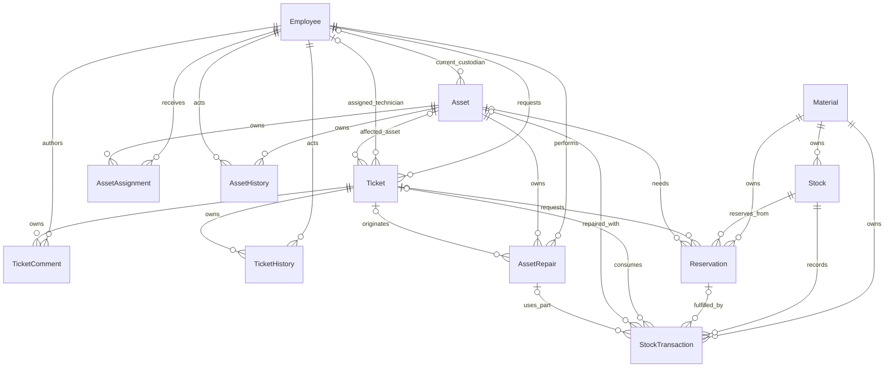

# Initial entity relationship model — v1

All technical primary keys are UUIDs. `?` means nullable. Fields below are the
minimum domain design. The five original entities have a complete
[field dictionary](../../docs/service-contract.md). Phase 4 adds assignment,
repair and asset-event sets documented in the [asset contract](../../docs/asset-lifecycle.md).
Inventory entities remain conceptual.

| Entity / set | Key | Principal fields and foreign keys | Owner |
| --- | --- | --- | --- |
| Employee / Employees | EmployeeUUID | EmployeeNumber, DisplayName, Email, Department, Location | External reference |
| Ticket / Tickets | TicketUUID | TicketNumber, Subject, Description, Status, Priority, RequesterUUID, TechnicianUUID?, AssetUUID?, Resolution? | Ticket root |
| Asset / Assets | AssetUUID | AssetTag, SerialNumber?, AssetType, Status, CurrentEmployeeUUID?, WarrantyEnd? | Asset root |
| TicketComment / TicketComments | TicketCommentUUID | TicketUUID, AuthorUUID, Text, CreatedAt | Ticket child |
| TicketHistory / TicketHistory | TicketHistoryUUID | TicketUUID, ActorUUID, Action, OldValue?, NewValue?, Reason?, CreatedAt | Ticket child, append-only |
| AssetAssignment / AssetAssignments | AssetAssignmentUUID | AssetUUID, EmployeeUUID, StartAt, EndAt?, Reason | Asset child |
| AssetRepair / AssetRepairs | AssetRepairUUID | AssetUUID, TicketUUID?, TechnicianUUID, Status, Diagnosis, RepairDescription?, StartedAt, RepairedAt? | Asset child |
| AssetHistory / AssetHistory | AssetHistoryUUID | AssetUUID, ActorUUID, Action, OldStatus?, NewStatus, OldEmployeeUUID?, NewEmployeeUUID?, Reason, CreatedAt | Asset child, append-only |
| Material / Materials | MaterialUUID | MaterialNumber, Description, UnitOfMeasure | Material root |
| Stock / Stocks | StockUUID | MaterialUUID, StorageLocation, PhysicalQuantity, ReservedQuantity, AvailableQuantity (derived) | Material child |
| Reservation / Reservations | ReservationUUID | MaterialUUID, StockUUID, TicketUUID?, AssetUUID?, Quantity, IssuedQuantity, Status, Reason | Material child |
| StockTransaction / StockTransactions | StockTransactionUUID | MaterialUUID, StockUUID, ReservationUUID?, TicketUUID?, AssetUUID?, AssetRepairUUID?, MovementType, Quantity, UnitOfMeasure, TransferUUID?, Reason, CreatedAt, CreatedBy | Material child, append-only |

Stock is unique by material + storage location. Assignment end is exclusive; open
assignments have null EndAt. CurrentEmployeeUUID is maintained from the current
assignment, never edited separately. AssetTag, MaterialNumber and TicketNumber
are unique business identifiers. EmployeeNumber uniqueness depends on source-system
scope. History and stock transactions cannot be deleted or overwritten by business
users; corrections append compensating records. Roots with audit dependencies are
retained or deactivated rather than cascade-deleted. Child ownership does not imply
permission to delete audit data.

Material, stock, reservation and movement references must agree. An optional asset
on a ticket-linked reservation must agree with the ticket's affected asset. Repeated
issues can fulfill one reservation in parts; transactions retain the originating
repair where applicable. Configuration entities are designed in phase 7.
